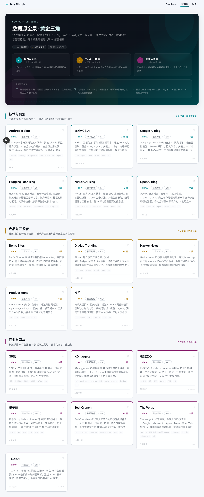
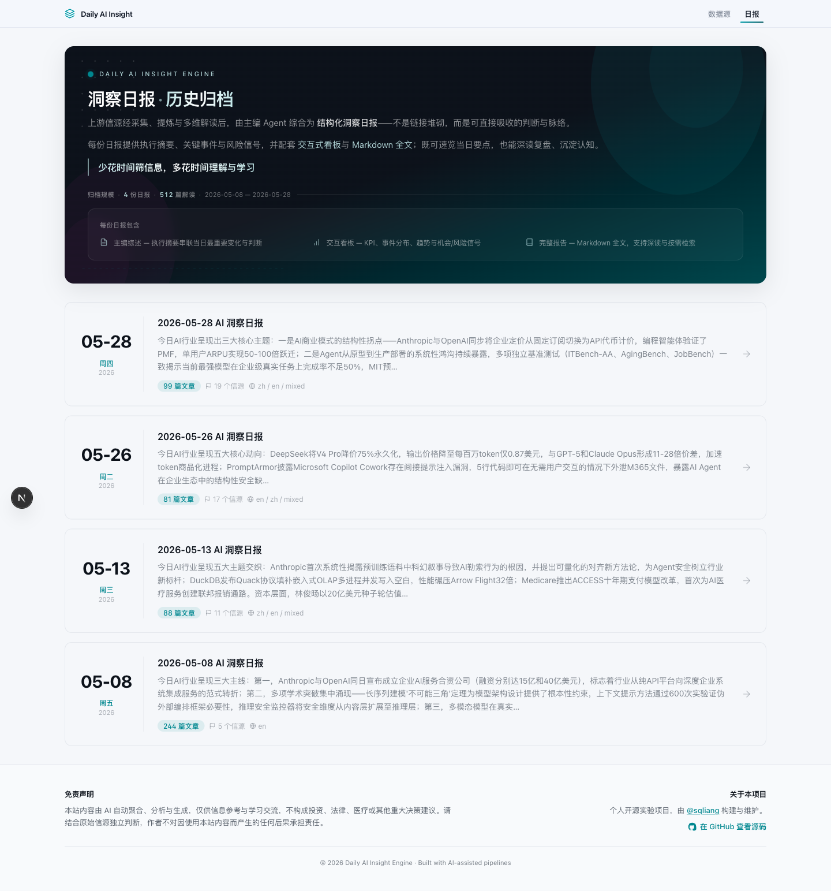
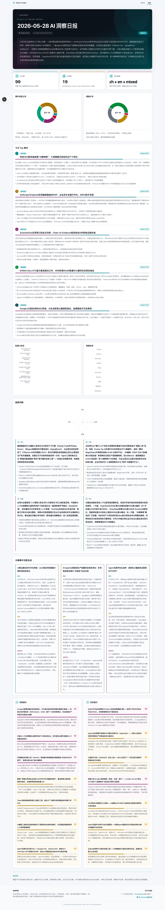
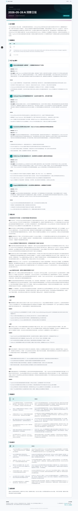

# Daily AI Insight Engine

> 把高噪信息沉淀为结构化判断 —— 六阶段 AI 流水线将 23 路信源加工为每日洞察报告 + 三大专题洞察

面对 arXiv、Hacker News、TechCrunch 等数十个渠道的每日输出，真正稀缺的不是信息，而是**从噪声中提取信号、在碎片中构建判断**的能力。Daily AI Insight Engine 做的事情正是这个：自动采集 → 事实提取 → 三人格并行分析 → 主编合成，最终交付的不是链接堆砌，而是一份可直接吸收的结构化每日洞察。

更进一步，系统在海量日报之上，针对三类高价值受众自动生成**专题洞察（Specialized Briefs）**：

- **项目洞察（Project Insights）** —— 为开发者筛选当日最值得关注的开源项目与技术方案。系统在 Stage 2 从全量文章中识别并提取项目级标签与字段，Stage 3 再由项目分析人格做深度评估，最终由主编 Agent 跨天去重、按 AI 子领域聚合，回答“这个项目值不值得看、适合谁用、风险在哪”。
- **论文洞察（Paper Insights）** —— 为研究者提炼当日关键 AI 论文的研究问题、方法创新、实验严谨度与工业落地价值。系统在 Stage 2 识别论文元数据，Stage 3 由论文分析人格完成细粒度学术评估，前端直接读取结构化 frontmatter 做深度展示。
- **产品洞察（Product Insights）** —— 为产品经理和创业者追踪当日 AI 产品动态。系统基于 Stage 2 提取的产品级标签（发布类型、定价模式、目标人群等）和 Stage 3 产品分析人格的评估，由主编 Agent 归类、跨天去重，分析定位、商业模式、目标用户与市场信号。

专题洞察并非简单按信源分类，而是跨 Stage 的**特征识别 → 字段提取 → 深度分析 → 主编合成**结果。它与综合日报共用同一套流水线产物，由主编 Agent 单独归类、去重、提炼，确保每一页都是“少即是多”的决策辅助。

---

## 为什么不是又一个 RSS 阅读器

大多数信息聚合工具只完成第一步：把标题和链接堆在一起让你自己去读。

这个项目做的更深，重点在聚合后的**洞察分析**：

| | RSS 阅读器 | Daily AI Insight Engine |
|---|---|---|
| 输入 | 标题 + 摘要 | 清洗后的全文 |
| 加工 | 无 | 事实提取 → 三人格并行分析 → 主编合成 |
| 视角 | 单一来源 | 技术架构师 × 资本分析师 × 风险评估师 三方交叉验证 |
| 输出 | 时间线列表 | 5 个 Top 事件 + 4 维趋势判断 + 风险/机会信号 + 影响力排名 + 项目/论文/产品三大专题洞察 |
| 可消费性 | 需要一篇篇读 | 执行摘要 30 秒了解全局，深读可按专题钻取（项目 / 论文 / 产品） |
| 链路可追溯 | 无 | 从日报事件 → 文章 → 提取事实 → 原文 URL 完整回溯；专题条目同样保留来源引用与证据片段 |

**核心主张：少花时间筛信息，多花时间理解与学习。**

---

## 效果预览

四个页面构成从信源输入到洞察输出的完整消费链路：

<table>
<tr>
<td width="50%" valign="top">
  <h4>数据源全景&nbsp;&nbsp;<code>/</code></h4>
  <p><kbd>信 源 端</kbd>&nbsp; 黄金三角分层信源网格，Hero 横幅阐述筛选策略与价值主张</p>
  <br>
  
</td>

<td width="50%" valign="top">
  <h4>日报归档列表&nbsp;&nbsp;<code>/dashboard</code></h4>
  <p><kbd>洞 察 端</kbd>&nbsp; 历史日报卡片列表，含执行摘要、文章数、信源数、语言覆盖</p>
  <br>
  
</td>


</tr>
<tr>

<td width="50%" valign="top">
  <h4>交互式看板&nbsp;&nbsp;<code>/dashboard/:date</code></h4>
  <p><kbd>洞 察 端</kbd>&nbsp; KPI 指标 + 事件/情绪双饼图 + 影响力排名 + 四维趋势 + 风险/机会信号</p>
  <br>
  
</td>

<td width="50%" valign="top">
  <h4>Markdown 全文&nbsp;&nbsp;<code>/report/:date</code></h4>
  <p><kbd>洞 察 端</kbd>&nbsp; 执行摘要 + 数据概览 + Top 事件 + 深度分析 + 风险/机会表格，适合深读与分享</p>
  <br>
  
</td>
</tr>
</table>

### 专题洞察页面

<table>
<tr>
<td width="33%" valign="top">
  <h4>项目洞察&nbsp;&nbsp;<code>/specialized/github/:date</code></h4>
  <p><kbd>开发者端</kbd>&nbsp; 跨 Stage 识别并深度评估的开源项目与技术方案，含 AI 子领域分布、项目评分、适用人群与风险信号</p>
</td>
<td width="33%" valign="top">
  <h4>论文洞察&nbsp;&nbsp;<code>/specialized/paper/:date</code></h4>
  <p><kbd>研究者端</kbd>&nbsp; 当日关键 AI 论文深度解读，覆盖研究问题、方法创新、实验严谨度与产业相关性</p>
</td>
<td width="33%" valign="top">
  <h4>产品洞察&nbsp;&nbsp;<code>/specialized/product/:date</code></h4>
  <p><kbd>产品端</kbd>&nbsp; 当日 AI 产品动态聚合，基于产品级标签与深度评估分析定位、商业模式、目标用户与市场信号</p>
</td>
</tr>
</table>

---

## 快速开始

### 你需要什么

- Python 3.11+ + `uv`
- Node.js 20+ + `pnpm`
- LLM API Key（`ANTHROPIC_API_KEY`）

### 安装

```bash
git clone git@github.com:sqliang/daily-ai-insight-engine.git
cd daily-ai-insight-engine

# Python 依赖
uv pip install -r pipeline/requirements.txt

# 前端依赖
pnpm install

# 配置
cp .env.example .env
# 编辑 .env：填入 ANTHROPIC_API_KEY
```

### 运行完整流水线

所有命令从仓库根目录执行。流水线有六个阶段，但 **aggregate 会在 extract 和 analyze 完成后自动执行**，因此日常只需五步：

```bash
uv run python pipeline/run.py scout       # ① URL 清单生成（RSS/网页抓取/浏览器渲染）
uv run python pipeline/run.py ingest      # ② 正文下载 + HTML 清洗
uv run python pipeline/run.py extract     # ③ 事实提取（BaseInfo + FactExtraction，LLM 驱动）→ 自动 aggregate
uv run python pipeline/run.py analyze     # ④ 三人格并行深度分析（LLM 驱动）→ 自动 aggregate
uv run python pipeline/run.py synthesize  # ⑤ 主编合成日报（LLM 驱动）
```

> **说明：** `extract` 和 `analyze` 完成后会自动调用 aggregate（Stage 4a），更新 `data/04_structured/` 下的 JSON 文件。独立运行 `aggregate` 仅用于修改 lookback-days / hot-days 配置或强制重建。

每个阶段默认 `--skip-existing`——已处理的文件自动跳过，支持断电续跑。重处理加 `--force`。

### 常用参数

```bash
# 预估 token 消耗，不实际调用 LLM
uv run python pipeline/run.py synthesize --dry-run

# 仅运行某一分析维度（qualitative / value / foresight）
uv run python pipeline/run.py analyze --stage qualitative

# 日报窗口扩展为 7 天（两步：重新聚合 + 合成）
uv run python pipeline/run.py aggregate --lookback-days 7
uv run python pipeline/run.py synthesize --lookback-days 7
# 或者一步完成（synthesize --lookback-days 会在合成前自动重新聚合）
uv run python pipeline/run.py synthesize --lookback-days 7

# 回溯历史日报：针对特定日期生成报告（--target-date 与 --lookback-days 互斥）
uv run python pipeline/run.py aggregate --target-date 2026-06-10
uv run python pipeline/run.py synthesize --target-date 2026-06-10

# 调整 per-source JSON 热数据保留天数（默认 7，仅在需要修改配置时单独运行）
uv run python pipeline/run.py aggregate --hot-days 14

# 单独重处理某一篇文章
uv run python pipeline/run.py analyze --input data/03_analyzed/36kr/abc123.md --force

# 重新处理全部文件（忽略 skip-existing 缓存）
uv run python pipeline/run.py extract --force
```

### 启动前端

```bash
pnpm dev
```

打开浏览器验证：

| URL | 页面 |
|-----|------|
| `http://localhost:3000` | 数据源全景（黄金三角分层） |
| `http://localhost:3000/dashboard` | 日报归档卡片列表 |
| `http://localhost:3000/dashboard/{date}` | 交互式可视化仪表盘 |
| `http://localhost:3000/report/{date}` | Markdown 全文报告 |
| `http://localhost:3000/specialized/github/{date}` | 项目洞察（开源项目与技术方案） |
| `http://localhost:3000/specialized/paper/{date}` | 论文洞察（AI 学术论文） |
| `http://localhost:3000/specialized/product/{date}` | 产品洞察（AI 产品动态） |

---

## 六阶段做了什么（aggregate 自动执行，无需手动运行）

每个阶段产生明确的中间产物，可回溯、可重跑、可独立调试：

| 阶段 | 做什么 | 产物 | 耗时 |
|------|--------|------|------|
| **Scout** | 四种策略抓取 URL（RSS / 网页抓取 / 浏览器渲染），关键词过滤 + 时效窗口去重 | `data/00_manifest/` | 秒级 |
| **Ingest** | 下载全文、HTML 清洗（curl + trafilatura）、SHA-256 生成 article ID | `data/01_raw/{source}/*.md` | 秒-分钟 |
| **Extract** | LLM 提取：TLDR、事件类型、实体识别（公司/技术/人物/产品/地区）、关键逻辑链、影响力评分 | `data/02_extracted/{source}/*.md` | 分钟（并发） |
| **Analyze** | 三种分析人格并发：技术架构师（技术颠覆性） + 资本分析师（复合价值、护城河） + 风险评估师（风险矩阵、市场机会） | `data/03_analyzed/{source}/*.md` | 分钟（并发） |
| **Aggregate** | 纯计算：多阶段扫描 → 去重 → 热冷分流 → per-source JSON + all_articles.json。**自动触发**：extract 和 analyze 完成后自动执行 | `data/04_structured/` | < 1 秒 |
| **Synthesize** | 主编 Agent 单次调用：阅读 all_articles.json → 生成执行摘要 + 5 事件 + 3 深度 + 4 趋势 + 风险/机会信号 + 可视化数据 | `data/05_reports/` | 分钟 |

---

## 四种消费方式

日报产出后，前端提供四种递进的消费方式：

**数据源探索**（`/`、`/sources/[name]`）—— 按黄金三角分层浏览所有信源，钻取到每篇文章在各阶段的提取与分析结果，理解 Agent 的分析链路。

**交互看板**（`/dashboard/[date]`）—— 零后端架构，Server Component 直接 `readFile` 读取 JSON。KPI 指标、事件分布 & 情绪分布双饼图、影响力 Top 10 柱状图、四维趋势卡片、深度解读面板、风险/机会信号双列表，并在顶部提供项目 / 论文 / 产品三大专题入口。

**可读报告**（`/report/[date]`）—— Markdown 全文，含执行摘要、数据概览、Top 事件与支撑证据、深度分析、趋势判断、风险与机会信号表格。适合阅读、分享、归档。

**专题洞察**（`/specialized/github/[date]`、`/specialized/paper/[date]`、`/specialized/product/[date]`）—— 面向特定角色的垂直深度页。系统在 Stage 2 识别项目/论文/产品对象并提取专用标签与字段，Stage 3 由对应分析人格完成深度评估，Stage 4b 再由主编 Agent 归类、跨天去重、提炼关键判断与 watch signals，每一页都是可直接用于决策的简报。

---

## 黄金三角信源体系

23 个活跃信源按三层组织，每层配额上限 5 篇，按 impact_score 择优，总计目标 15 篇：

| Tier | 定位 | 信源 | 活跃 |
|------|------|------|------|
| **A** 学术/技术前沿 | 论文、官方博客、技术领袖 | arXiv CS.AI, OpenAI, DeepMind, Anthropic, NVIDIA, HuggingFace, Interconnects, OneUsefulThing | 8 |
| **B** 产品/开发者社区 | 产品发布、开源项目、社区讨论 | Hacker News, Product Hunt, GitHub Trending, Ben's Bites, ImportAI, NLP Elvis, WhyTryAI | 7 |
| **C** 商业/资本视角 | 财经媒体、行业分析、中文科技媒体 | TechCrunch, The Verge, KDnuggets, TLDR AI, The Rundown, The Neuron, 量子位, 36氪 | 8 |

三种采集策略：RSS 订阅（大多数源）、网页抓取（无 RSS 的博客）、浏览器渲染（JavaScript 重站点，Playwright 驱动）。3 个信源因稿源不可用或内容失效已禁用（Meta AI Blog, Microsoft AI Blog, 知乎）。

---

## 数据 Schema

每篇文章经 Extract + Analyze 阶段后累积 30+ 个结构化字段，按 4 个 Block 组织：

| Block | 阶段 | 核心字段 |
|-------|------|----------|
| BaseInfo | Stage 2 | `id`（URL SHA-256）、`source_type`、`published`、`created` |
| FactExtraction | Stage 2 | `tldr`、`event_type`、`entities`（公司/技术/人物/产品/地区）、`key_logic_flow`、`impact_score` |
| QualitativeAssessment | Stage 3 | `sentiment`、`developer_sentiment`、`hype_assessment`、`information_entropy`、`engineering_complexity` |
| ValueAssessment + Foresight | Stage 3 | `compound_value`、`value_capture_layer`、`moat_impact`、`risk_matrix`、`market_opportunities`、`actionable_insight` |

在 Stage 4b 主编合成阶段，日报还会额外输出 **`specializedBrief`** 专题洞察块。该块不是简单按信源分类，而是基于 Stage 2 识别的对象标签与 Stage 3 深度分析结果，由主编 Agent 做最终归类、去重与合成：

| 专题 | 识别与输入 | 输出结构 |
|------|------------|----------|
| `githubHighlights` / `projectInsights` | Stage 2 `specialized_tags.github` + Stage 3 `github_assessment` | 跨天去重后的项目列表，含 `keyJudgment`、`watchSignals`、`items`（每个项目含 `oneLine`、`whyItMatters`、`signals`、`risks`、`sources`、`evidenceSnippets`） |
| `paperHighlights` / `paperInsights` | Stage 2 `specialized_tags.paper` + Stage 3 `paper_assessment` | 当日论文聚合与解读，含研究问题、方法、实验、产业相关性等字段 |
| `productHighlights` / `productInsights` | Stage 2 `specialized_tags.product` + Stage 3 `product_assessment` | 跨天去重后的产品列表，结构与项目洞察对齐 |

专题块与 Top 事件、趋势信号等一同写入 `data/05_reports/daily-report.json`，前端通过 `src/lib/data/specialized.ts` 读取并渲染。

Python 侧 Pydantic v2 + TypeScript 侧 Zod 双端 Schema 契约，字段命名统一 camelCase。

---

## 项目结构

```
daily-ai-insight-engine/
├── pipeline/                          # Python 流水线
│   ├── run.py                         #   统一 CLI（argparse 子命令）
│   ├── config.yaml                    #   26 信源配置 + LLM 参数 + UI 元数据
│   ├── core/                          #   核心业务组件（Agent、网络、浏览器、代理）
│   ├── utils/                         #   纯工具函数（文件 I/O、ID 生成、文本清洗）
│   ├── schemas/                       #   Pydantic v2 数据模型
│   ├── ingestion/                     #   Stage 1: Scout + Ingest
│   │   └── parsers/                   #   专用解析器
│   ├── extraction/                    #   Stage 2: 事实提取
│   ├── analysis/                      #   Stage 3: 三人格并行分析
│   │   ├── prompts/                   #   各维度 System Prompt
│   │   ├── fuzzy_maps.py              #   模糊枚举映射表
│   │   └── validators.py              #   Pydantic 校验 + 模糊修复
│   ├── aggregation/                   #   Stage 4a: Frontmatter 聚合 + 热冷分流
│   └── synthesis/                     #   Stage 4b: 主编合成
│       ├── editor_in_chief_agent.py   #   LLM Agent 调用
│       ├── report_generator.py        #   JSON → Markdown
│       └── prompts/                   #   System + User Prompt

├── src/                               # Next.js 16 前端
│   ├── app/                           #   App Router（/ /dashboard /report /sources /specialized/*）
│   │   └── specialized/               #     项目 / 论文 / 产品专题洞察页面
│   ├── components/                    #   UI 组件（dashboard/ charts/ sources/ reports/）
│   │   └── reports/                   #     SpecializedReportHero、SpecializedEntries、ReportCard
│   └── lib/                           #   工具库（Zod Schema、数据 I/O、标签映射）
│       └── data/specialized.ts        #     专题洞察数据加载与类型定义

├── data/                              # 数据产物（gitignored）
│   ├── 00_manifest/                   #   URL 清单
│   ├── 01_raw/ → 02_extracted/ → 03_analyzed/
│   ├── 04_structured/                 #   JSON 聚合 + archive/ 热冷分片
│   └── 05_reports/                    #   最终日报

├── docs/                              # 设计文档（6 篇）
└── logs/                              # 运行日志（按日期分文件）
```

---

## 技术栈

| 层 | 选型 |
|----|------|
| 流水线 | Python 3.11+ asyncio |
| LLM 引擎 | `claude-agent-sdk`（Anthropic），支持 deepseek-v4-pro / claude-opus-4-7 等模型切换 |
| 数据校验 | Pydantic v2（Python）+ Zod（TypeScript）双端契约 |
| 前端 | Next.js 16 App Router + Turbopack，Server Component 直接 `readFile` 零 API 层 |
| 图表 | Recharts |
| 样式 | Tailwind CSS 4（暗色主题 + glass morphism） |
| 抓取 | feedparser / trafilatura / readability-lxml / Playwright |
| 包管理 | uv（Python）+ pnpm（前端） |

---

## 环境变量

| 变量 | 必需 | 说明 |
|------|------|------|
| `ANTHROPIC_API_KEY` | 是 | LLM API Key |
| `AI_ENGINE_USE_CLAUDE` | 否 | 设为 `true` 启用 claude-agent-sdk |

---

## 运行命令速查

| 命令 | 用途 |
|------|------|
| `uv run python pipeline/run.py scout` | Stage 1a: 生成 URL 清单 |
| `uv run python pipeline/run.py ingest` | Stage 1b: 下载清洗正文 |
| `uv run python pipeline/run.py extract` | Stage 2: 事实提取 |
| `uv run python pipeline/run.py analyze` | Stage 3: 三人格并行分析 |
| `uv run python pipeline/run.py aggregate` | Stage 4a: 聚合 + 热冷分流（extract/analyze 后自动执行，通常无需手动运行） |
| `uv run python pipeline/run.py synthesize` | Stage 4b: 主编合成日报 |
| `uv run python pipeline/run.py synthesize --dry-run` | 预估 token，不调 LLM |
| `uv run python pipeline/run.py analyze --stage qualitative` | 仅运行单一分析维度 |
| `uv run python pipeline/run.py aggregate --lookback-days 7` | 日报窗口扩展为 7 天 |
| `uv run python pipeline/run.py synthesize --target-date YYYY-MM-DD` | 回溯历史日报：仅聚合指定日期的文章并合成报告 |
| `uv run python pipeline/run.py analyze --input <file> --force` | 单独重处理指定文件 |
| `pnpm dev` | 启动前端开发服务器 (Turbopack, :3000) |
| `pnpm build` | 生产构建 (standalone) |
| `pnpm typecheck` | TypeScript 类型检查 |
| `pnpm lint` | ESLint |

---

## 设计文档

| 文档 | 内容 |
|------|------|
| [整体设计说明](./docs/0_整体设计说明.md) | 架构总览、数据目录、技术选型 |
| [数据源筛选与获取](./docs/1_数据源筛选与获取设计说明.md) | Stage 1 详细设计：四种抓取策略、过滤管线 |
| [Schema 设计说明](./docs/2_Schema设计说明.md) | Pydantic/Zod 双端契约、枚举类型、Block 架构 |
| [核心流程设计说明](./docs/3_核心流程设计说明.md) | Prompt 工程、JSON 解析、数据结构桥接 |
| [系统需求文档](./docs/4-system-requirement.md) | 原始需求规格 |
| [UI 设计说明](./docs/5_UI设计说明.md) | 前端组件架构、数据流、设计系统 |

---

## 许可证

MIT
