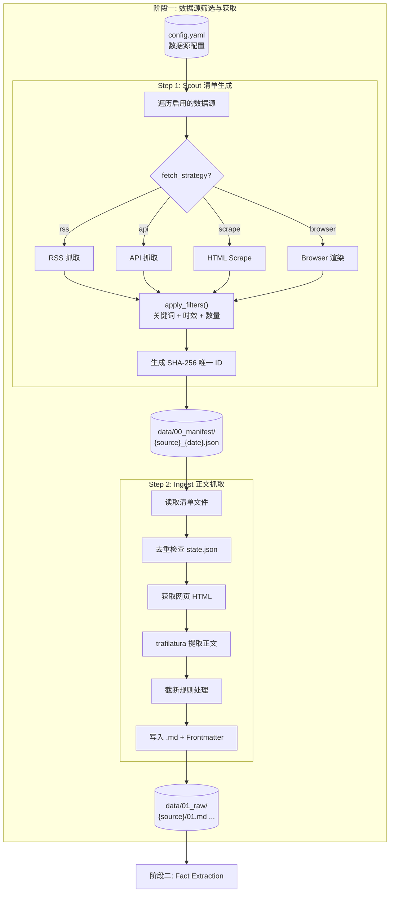
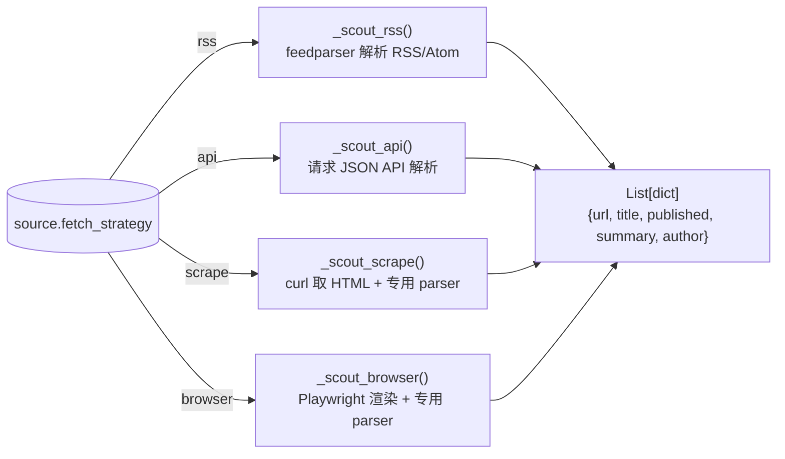
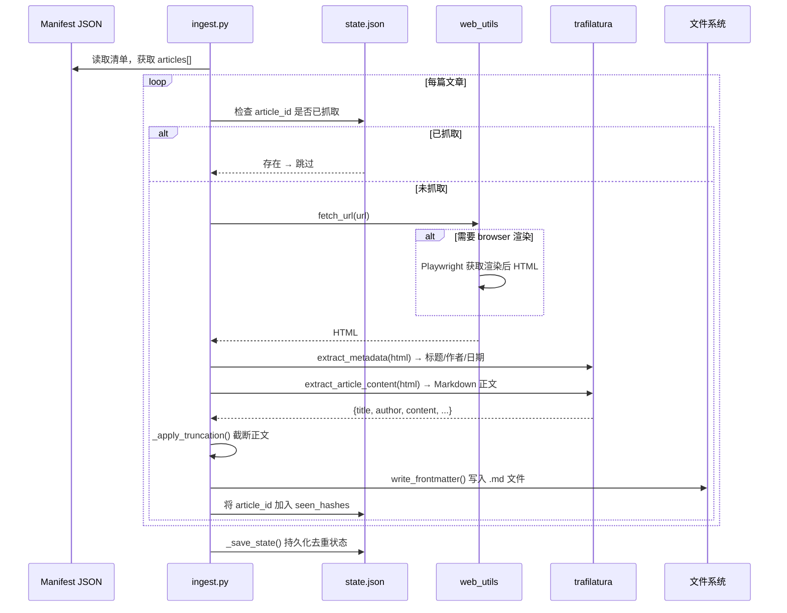

# 阶段一：数据源筛选与获取设计说明

## 1. 设计目标

数据源筛选与获取是整个 Daily AI Insight Engine 流水线的**入口阶段**。该阶段需要从数十个异构数据源中，定时、可靠地获取当日 AI 领域的最新文章，并将其转化为统一格式的本地 Markdown 文件，供后续的事实提取与深度分析阶段消费。

核心设计目标：

| 目标 | 说明 |
|------|------|
| **多源异构适配** | 数据源形态各异（RSS Feed、JSON API、静态 HTML、SPA 页面），需统一接入层屏蔽差异 |
| **信号-噪声分离** | 在获取阶段即完成关键词过滤和时效性筛选，避免低质量内容进入下游管道 |
| **确定性 + 幂等性** | 同一篇文章在任意时间、任意次抓取中拥有相同的唯一标识，支持去重和断点续传 |
| **可扩展性** | 新增数据源只需修改配置文件和注册解析器，无需改动编排逻辑 |

---

## 2. 整体架构

该阶段采用 **"发现-采集"两阶段分离**的架构模式，分为 Scout（清单生成）和 Ingest（正文抓取）两个子步骤，中间以轻量级 JSON 清单文件作为接口。



### 2.1 为什么分离 Scout 与 Ingest

- **解耦速率瓶颈**：Scout 只需拉取文章列表（KB 级），速度快；Ingest 需要逐篇下载并清洗完整网页正文（MB 级），速度慢。分离后，即使 Ingest 中断，已生成的文章也不会丢失。
- **断点续传**：manifest JSON 记录当日该数据源的全部待抓取 URL，state.json 追踪已抓取的 article_id。重跑时自动跳过已完成项。
- **可独立调试**：可以单独运行 Scout 查看某源的当日文章列表，而不触发全量正文下载。

---

## 3. 数据源分层体系

所有数据源按 **"黄金三角"体系** 组织为三个层级（Tier A/B/C），对应不同的内容类型和抓取策略权重。

```mermaid
graph LR
    subgraph TierA["Tier A: 学术与技术前沿"]
        arxiv["arXiv cs.AI<br/>学术论文"]
        openai["OpenAI Blog<br/>官方发布"]
        deepmind["Google/DeepMind<br/>研究博客"]
        anthropic["Anthropic News<br/>官方发布"]
        nvidia["NVIDIA Blog<br/>硬件/训练"]
        huggingface["Hugging Face<br/>模型/工具"]
    end
    
    subgraph TierB["Tier B: 产品与开发者情绪"]
        hn["Hacker News<br/>社区讨论"]
        ph["Product Hunt<br/>产品发布"]
        github["GitHub Trending<br/>开源趋势"]
        bensbites["Ben's Bites<br/>AI 日报"]
        zhihu["知乎发现<br/>中文社区"]
    end
    
    subgraph TierC["Tier C: 商业落地与资本动向"]
        tc["TechCrunch<br/>科技新闻"]
        verge["The Verge<br/>AI 报道"]
        kdnuggets["KDnuggets<br/>教程/新闻"]
        tldrai["TLDR AI<br/>每日聚合"]
        machineheart["机器之心<br/>中文产经"]
        qubit["量子位<br/>中文前沿"]
        36kr["36氪<br/>创投报道"]
    end
    
    TierA --- TierB --- TierC
```



### 3.1 配置化驱动的分层管理

每个数据源在 `pipeline/config.yaml` 中的配置结构如下：

```yaml
- name: "arxiv-cs-ai"          # 唯一标识，对应对应 parser 注册表中的 key
  type: academic_paper          # 内容类型枚举：academic_paper | tech_blog | news_media | community_discussion
  tier: A                       # 层级：A (核心) | B (重要) | C (补充)
  enabled: true                 # 是否启用，false 时 scout 自动跳过
  description: "..."            # 人类可读的描述
  url: "https://..."            # 数据入口 URL
  language: en                  # 语言代码：en | zh
  fetch_strategy: rss           # 抓取策略：rss | api | scrape | browser
  wait_for: ".article-item"     # (仅 browser) CSS 选择器，等待元素出现
  filter:                       # 过滤规则
    keywords: [...]             # 关键词白名单
    max_age_hours: 48           # 最大时效（小时）
    score_threshold: 100        # (仅 HN) 最低评分阈值
  truncation:                   # 正文截断规则
    mode: abstract_only         # 截断模式：abstract_only | first_n_chars | none
    limit: 3000                 # (仅 first_n_chars) 截断字符数
  limit: 8                      # 每源最大文章数
  target_dir: "arxiv"           # 输出子目录名 (默认与 name 相同)
```

**关键设计决策**：配置即代码。全部数据源元信息集中在 `config.yaml` 中声明，`config_loader.py` 模块提供带缓存的配置读取 API（`get_sources(enabled_only=True)`、`get_source_by_name(name)`），运行时不依赖硬编码的数据源列表。

---

## 4. 四策略抓取机制

每个数据源通过 `fetch_strategy` 字段指定抓取方式。Scout 阶段根据该字段将请求分发到对应的处理函数。



### 4.1 RSS 策略 (feedparser)

最简单、最可靠的策略。直接解析标准的 RSS 2.0 / Atom feed，适用于大多数博客和新闻站点。

- **技术实现**：`fetch_rss_items()` 使用 `feedparser` 库解析 feed，自动处理 `published_parsed`、`author_detail` 等结构化字段，输出标准化字典列表
- **适用场景**：OpenAI Blog、Hugging Face、TechCrunch、The Verge 等提供标准 feed 的站点
- **基础设施依赖**：curl 子进程 + 环境代理注入

### 4.2 API 策略 (JSON 接口)

面向提供结构化数据 API 的数据源。当前以 Hacker News 为典型实现。

- **通用处理**：`_scout_api()` 发起 GET 请求，按 `data.items` / `data.results` 路径解析 JSON，提取 URL、标题等字段
- **HN 专用增强**：`_scout_hackernews()` 针对 Algolia 搜索结果增加了 `score_threshold` 过滤，只保留 points ≥ 阈值的文章，避免大量低质讨论进入管线
- **降级处理**：当 JSON 解析失败时返回空列表，不阻塞其他数据源

### 4.3 Scrape 策略 (HTML 解析器注册表)

面向没有 RSS 但提供服务端渲染 HTML 的站点。Scout 获取页面 HTML 后，通过**按名称查找的解析器注册表**将 HTML 委托给专用解析器处理。

```python
# pipeline/ingestion/parsers/__init__.py 中的解析器注册表
SCRAPE_PARSERS = {
    "tldrai":         parse_tldrai,         # TLDR AI 每日聚合
    "anthropic-blog": parse_anthropic,      # Anthropic sitemap 解析
    "machine-heart":  parse_machine_heart,  # 机器之心文章列表
}
```

**解析器注册表的设计优势**：
- `scout` 不感知具体解析逻辑，只需按 `source.name` 查找对应的 parser 函数并调用
- 新增数据源时只需在注册表中加一行映射，无需改动框架代码
- 解析器可返回空列表表达 "未匹配到内容"，框架自动跳过该源

**代表性解析器**：

| 解析器 | 数据源 | 技术方案 |
|--------|--------|----------|
| `parse_tldrai` | TLDR AI | 正则提取 `Headlines & Launches` 和 `Engineering & Research` 板块的 `<a>` 链接 |
| `parse_anthropic` | Anthropic Blog | 解析 `sitemap.xml`，提取 `/news/` 路径，按 `lastmod` 排序取最新 |
| `parse_machine_heart` | 机器之心 | 正则匹配 `/articles/YYYY-MM-DD-xxx` 路径并去重（已降级为 browser 策略） |

### 4.4 Browser 策略 (Playwright 无头浏览器)

面向现代 SPA（单页应用）站点，这些站点依赖 JavaScript 动态渲染内容，curl 只能拿到空白页面或 loading 骨架。

```python
# pipeline/ingestion/parsers/__init__.py 中的浏览器解析器注册表
BROWSER_PARSERS = {
    "zhihu":         parse_zhihu_browser,          # 知乎发现页
    "machine-heart": parse_machine_heart_browser,  # 机器之心 SPA 渲染
}
```

- **会话复用**：Scout 和 Ingest 阶段分别在入口处理检测是否有 browser 策略的源。如有，提前创建 `BrowserSession` 并在整个阶段中复用（`__enter__` 启动，`__exit__` 关闭），避免为每篇文章重复启动 Chromium
- **等待策略**：通过 `wait_for` 配置项指定 CSS 选择器，Playwright 等待目标元素出现后再提取 HTML，确保 JS 已完成渲染
- **反检测措施**：BrowserSession 默认启用真实 Chrome UA、`bypass_csp`、`--disable-blink-features=AutomationControlled` 等参数，降低被反爬虫系统拦截的概率
- **代理支持**：自动读取 `pipeline/config/proxy.json` 配置并注入浏览器 context

**代表性解析器**：

| 解析器 | 数据源 | 技术方案 |
|--------|--------|----------|
| `parse_zhihu_browser` | 知乎 | `networkidle` 等待后，遍历所有链接，提取 `/question/` 和 `/p/` 路径 |
| `parse_machine_heart_browser` | 机器之心 | 等待 `.article-item` 元素，通过 `query_selector_all` 提取文章链接 |

---

## 5. 过滤管线

Scout 阶段获取文章列表后，通过三层过滤器（责任链模式）逐级筛选，确保进入后续管道的内容质量。


### 5.1 关键词过滤 (`filter_by_keywords`)

- **逻辑**：标题 + 摘要拼接后统一小写，任一关键词命中即保留
- **空列表语义**：当 `keywords: []` 时跳过该过滤器，全量保留（适用于已在前端完成过滤的数据源，如 hnrss 已按 points>=100 预过滤）
- **设计考量**：关键词列表在 `config.yaml` 中针对每个数据源独立配置，可根据该源的内容特点定制。例如 arXiv 关注算法论文（RLHF、diffusion、multimodal），而知乎关注社区热议（大模型、GPT、Claude）

### 5.2 时效性过滤 (`filter_by_age`)

- **逻辑**：`max_age_hours` 定义文章的最大允许年龄。`parse_datetime()` 支持 7 种常见日期格式（ISO 8601、RFC 2822、简写日期等），解析成功且超时的文章被丢弃
- **保守策略**：无法解析日期的文章**不予丢弃**（宁可多保留也不丢失有效内容）
- **默认值**：大多数源设为 48~72 小时，平衡覆盖面和时效性

### 5.3 数量裁剪 (`filter_by_limit`)

- **逻辑**：`limit` 字段控制每个数据源每轮最多获取的文章数。`limit=0` 表示不限制
- **设计意图**：控制下游 LLM 调用成本（Token 消耗），同时保证报告覆盖多源的多样性而非单一源的信息泛滥

---

## 6. 文章唯一标识 (ID) 生成

文章 ID 是整个 Pipeline 的**贯穿性主键**，在 Scout 阶段生成，在所有后续阶段中用于去重和关联。

```
ID 生成算法: SHA-256(source_url) → hexdigest() → 取前 16 个十六进制字符
```

| 特性 | 说明 |
|------|------|
| **确定性** | 相同 URL 始终生成相同 ID，天然支持幂等性 |
| **零成本** | 纯数学哈希运算，无需 LLM 调用 |
| **足够唯一** | 64 位哈希空间，10^9 篇文章时碰撞概率 < 10^-10 |
| **阶段一致** | Scout 生成后写入 manifest JSON，Ingest 写入 Frontmatter，Extract 和 Analyze 阶段通过 Frontmatter 读取 |

> 旧版曾使用 MD5 前 12 位，已迁移为 SHA-256 前 16 位。`_load_state()` 检测到旧格式时自动重置去重列表（见 `ingest.py:254-273`）。

---

## 7. 正文抓取与 Markdown 生成

Ingest 阶段负责将清单中的 URL 转化为带有丰富 Frontmatter 的本地 Markdown 文件。

### 7.1 抓取流程



### 7.2 正文截断规则

进入下游 LLM 处理阶段前，需要对正文进行适当裁剪以控制 Token 消耗。每个数据源可独立配置截断策略：

| 模式 | 行为 | 适用场景 |
|------|------|----------|
| `none` | 不截断，保留完整正文 | 评分高、内容精炼的源（如 Hacker News、GitHub Trending） |
| `first_n_chars` | 保留前 N 个字符，在最近段落边界处截断 | 大多数博客和新闻源 |
| `abstract_only` | 仅保留以 `> Abstract` 开头的 Markdown 块引用段落 | 学术论文源（arXiv），正文冗长但摘要信息密度高 |

**段落边界感知截断** (`ingest.py:233-239`)：`first_n_chars` 模式下，当正文超过限制时，代码会在 `limit` 处寻找最后一个 `\n\n`（段落分隔符），在段落边界处截断。如果最近的段落分隔符距离 `limit` 超过 50% 位置，则退化为硬截断。

### 7.3 Frontmatter 标准化

每篇抓取的文章写入文件时附带标准化的 YAML Frontmatter，为后续处理阶段提供可被编程访问的元数据：

```yaml
---
title: "GPT-5: What We Know So Far"
source: "https://example.com/gpt5-article"
author:
  - "[[John Smith]]"
published: "2026-05-08"
created: "2026-05-08"
description: "A comprehensive overview of GPT-5 capabilities..."
tags:
  - "clippings"
id: "a1b2c3d4e5f6g7h8"  # Scout 阶段生成的唯一 ID
---
```

- **author 格式**：采用 `[[Author Name]]` 的 wiki-link 写法，为未来构建知识图谱和实体链接预留扩展空间
- **id 字段**：由 Scout 阶段的 SHA-256 ID 贯穿写入，实现跨阶段的文章追踪
- **原子写入**：通过 `tempfile` + `rename` 确保写入过程中进程崩溃不会损坏目标文件

### 7.4 去重与状态管理

去重状态存储在 `data/state.json` 中，结构为：

```json
{
  "seen_hashes": [
    "a1b2c3d4e5f6g7h8",
    "b2c3d4e5f6g7h8i9"
  ],
  "last_ingest": "2026-05-08T14:30:00+00:00"
}
```

- **持久化时机**：每个数据源处理完毕后立即写入 state.json，而非等全部源处理完再写，防止中途崩溃丢失进度
- **force 模式**：`--force` 参数会忽略 state.json 中的去重列表，强制重新抓取全部文章

---

## 8. 核心模块职责速览

| 模块 | 文件路径 | 职责 |
|------|----------|------|
| **配置加载器** | `pipeline/core/config_loader.py` | 加载 `config.yaml`，提供 `get_sources()`、`get_source_by_name()` 等查询 API，内存缓存避免重复 I/O |
| **Scout 编排器** | `pipeline/ingestion/scout/` | 遍历启用的数据源，按 `fetch_strategy` 分发抓取，调用过滤器，生成 manifest JSON |
| **Ingest 编排器** | `pipeline/ingestion/ingest.py` | 读取 manifest，逐篇抓取正文，去重检查，截断处理，写入 Markdown 文件 |
| **过滤器** | `pipeline/ingestion/filters.py` | 提供关键词、时效性、数量三个独立过滤函数，被 Scout 调用 |
| **解析器注册表** | `pipeline/ingestion/parsers/__init__.py` | 维护 `SCRAPE_PARSERS` 和 `BROWSER_PARSERS` 两个字典，按 source.name 映射解析器函数 |
| **专用解析器** | `pipeline/ingestion/parsers/{source}.py` | 各数据源的定制化 HTML/DOM 解析逻辑 |
| **网络工具** | `pipeline/core/web_utils.py` | curl 子进程封装、feedparser RSS 解析、trafilatura 正文提取 |
| **浏览器工具** | `pipeline/core/browser_utils.py` | Playwright 生命周期管理、页面渲染、代理注入、反检测配置 |
| **ID 生成器** | `pipeline/core/id_utils.py` | 基于 URL 的 SHA-256 确定性 ID 生成 |
| **文件工具** | `pipeline/core/file_utils.py` | 项目根目录解析、目录创建、原子写入、JSON 读写、序号文件生成、数据目录映射 |
| **Frontmatter 工具** | `pipeline/core/frontmatter_utils.py` | YAML Frontmatter 读写及标准字段构建 |
| **代理工具** | `pipeline/core/proxy_utils.py` | 从 `pipeline/config/proxy.json` 加载代理配置并注入环境变量 |

---

## 9. 数据产出

Scout + Ingest 阶段的最终产出路径与格式：

```
data/
├── 00_manifest/                          # Scout 阶段产出
│   ├── arxiv-cs-ai_20260508.json         # JSON 清单，包含 source / tier / articles[]
│   ├── hackernews_20260508.json
│   ├── techcrunch_20260508.json
│   └── ...
│
├── 01_raw/                               # Ingest 阶段产出
│   ├── arxiv/
│   │   ├── 01.md                         # YAML Frontmatter + Markdown 正文
│   │   ├── 02.md
│   │   └── ...
│   ├── bensbites/
│   │   ├── 01.md
│   │   └── ...
│   ├── techcrunch/
│   │   ├── 01.md
│   │   └── ...
│   └── ...
│
└── state.json                            # 全局去重状态
```

---

## 10. 设计总结

数据源筛选与获取阶段的核心理念是 **"在入口处做好噪声过滤，让下游专注智能分析"**。通过以下设计决策实现这一目标：

1. **发现与采集解耦**：Scout 生成的 manifest JSON 是轻量级的 "任务清单"，使得 Ingest 可以安全中断和恢复
2. **策略模式统一多源差异**：四种 `fetch_strategy` + 按名称注册的解析器，将异构数据源的接入逻辑收敛到最小的可替换单元
3. **声明式过滤管线**：所有筛选规则（关键词、时效、数量）都在 `config.yaml` 中声明，调整过滤策略无需修改代码
4. **确定性贯穿主键**：SHA-256 ID 从 Scout 阶段生成并贯穿全链，实现跨阶段的文章追踪和去重
5. **可扩展架构**：新增数据源 = 在 `config.yaml` 中加一条配置 + 在 parser 注册表中加一行映射（仅在需要 scraper/browser 时），无需触碰编排代码
