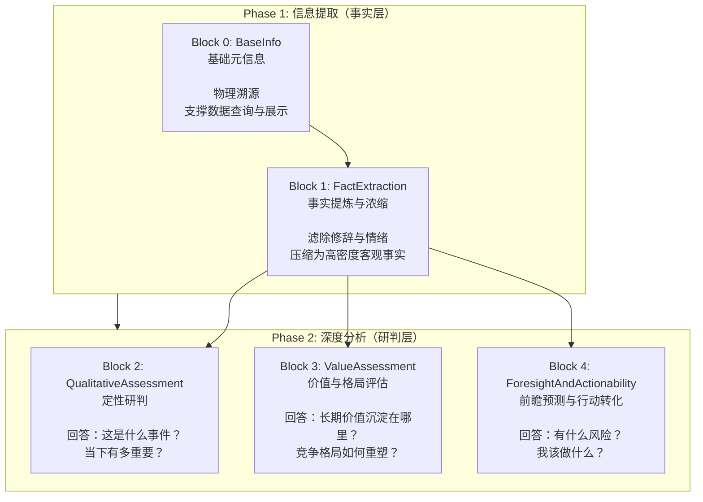
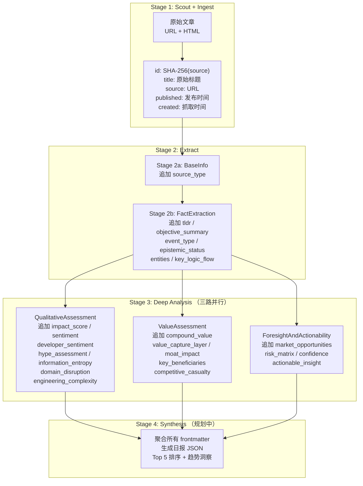

# 阶段二：Schema 字段设计说明

## 1. 设计目标

Schema 层是 Daily AI Insight Engine 的**核心数据契约**。它定义了从一篇嘈杂的非结构化新闻中，系统需要提取哪些维度的信息，以及这些信息以怎样的结构化形式向下游传递。

核心设计目标：

| 目标 | 说明 |
|------|------|
| **信息降维** | 将数千字的新闻长文压缩为一组精炼的枚举标签 + 结构化字段，使机器可计算、可聚合、可排序 |
| **维度完备** | 覆盖"溯源 → 事实 → 研判 → 价值 → 风险 → 行动"的完整认知链路，避免分析盲区 |
| **正交解耦** | 语义相关的字段刻意拆分为独立维度（如 `sentiment` 与 `developerSentiment`、`hypeAssessment` 与 `informationEntropy`），避免概念混杂导致分析失真 |
| **人机可读** | 所有字段以 YAML frontmatter 形式嵌入 Markdown 文件，LLM 可直接消费，开发者可直接肉眼 Debug |
| **容错优先** | 通过枚举模糊匹配、嵌套结构自动修复、交叉互换检测等机制，容忍 LLM 输出的格式偏差 |

---

## 2. 整体架构：两阶段、四区块

Schema 设计遵循 **"先事实，后判断"** 的认知分层原则，划分为两个阶段、四个区块。阶段间存在严格的依赖关系——Phase 2 的深度分析依赖 Phase 1 提取的事实作为推理依据。



**层级依赖说明**：

- Phase 1 内部：BaseInfo 先于 FactExtraction（FactExtraction 需要 title、source 等元信息辅助提取），Stage 2a 全部完成后才启动 Stage 2b
- Phase 2 内部：三个维度**平铺并行**——QualitativeAssessment、ValueAssessment、ForesightAndActionability 之间无互相依赖，通过 `asyncio.gather` 在同一文件内并行调用三个独立 Agent
- 跨阶段：Phase 2 以 Phase 1 的全部产出（tldr、entities、keyLogicFlow 等）作为上下文输入

---

## 3. 顶层容器：DailyAIInsight

`DailyAIInsight` 是整条流水线的**唯一顶层数据模型**。它不做任何业务逻辑，仅作为四个子模型的容器，将 Phase 1 和 Phase 2 的产出组装为一个完整的"单篇文章认知单元"。

```python
class DailyAIInsight(BaseModel):
    base_info: BaseInfo                             # Phase 1：物理溯源
    fact_extraction: FactExtraction                  # Phase 1：事实浓缩
    qualitative_assessment: QualitativeAssessment    # Phase 2：定性研判
    value_assessment: ValueAssessment                # Phase 2：价值评估
    foresight_and_actionability: ForesightAndActionability  # Phase 2：前瞻行动
```

该模型在当前的 Stage 2/3 实现中并未直接实例化——各阶段以**字段粒度**将提取结果写入 Markdown 文件的 YAML frontmatter 中，而非每次重写整个 `DailyAIInsight` 对象。这种"渐进式字段追加"策略避免了阶段间的写入冲突，也让每个阶段的产出增量一目了然。

---

## 4. Block 0：基础元信息（BaseInfo）

### 4.1 设计意图

BaseInfo 回答最基本的溯源问题："**这篇文章是谁写的、什么时候发表的、从哪来的？**" 这些字段是所有后续分析的物理锚点——如果连文章来源都不可追溯，深度分析就失去了可信度的根基。

### 4.2 字段结构

| 字段 | 类型 | 必填 | 说明 | 生成方式 |
|------|------|------|------|----------|
| `id` | `str` | 是 | 文章唯一标识，SHA-256(source URL) 取前 16 位十六进制字符 | Stage 1 Scout 阶段确定性计算 |
| `title` | `str` | 是 | 文章原始标题，保留原始语境，不作改写 | Stage 1 Ingest 阶段从网页元数据提取 |
| `source` | `str` | 是 | 原始链接 URL，数据可追溯性的根本保障 | Stage 1 Ingest 阶段从 manifest 继承 |
| `published` | `str` | 是 | 文章发布时间，用于构建时间轴和时效性判断 | Stage 1 Ingest 阶段从网页元数据提取 |
| `created` | `str` | 是 | 数据抓取时间戳，记录"我们什么时候获取了这篇文章" | Stage 1 Ingest 阶段自动生成 |
| `source_type` | `SourceType` | 是 | 信息源类型枚举，标识文章来源的生态属性 | Stage 2a 从目录名推断（优先）或 LLM 分类 |

### 4.3 source_type 枚举：信源决定信噪比

这是 BaseInfo 中最关键的语义字段。不同生态位的信息源，其内容的可信度、水分含量和行动价值截然不同：

| 枚举值 | 生态位 | 典型来源 | 内容特征 | 可信度权重 |
|--------|--------|----------|----------|------------|
| `academic_paper` | 学术前沿 | arXiv、学术会议 | 技术密度高、无商业包装、落地路径不确定 | 技术可信度高，商业可信度低 |
| `tech_blog` | 官方发布 | OpenAI Blog、Anthropic News、Hugging Face | 第一手技术细节、但可能夹带产品营销 | 技术可信度高，需剔除话术水分 |
| `news_media` | 科技媒体 | TechCrunch、The Verge、机器之心 | 第三方报道、商业视角、记者署名 | 商业可信度中，技术细节可能失真 |
| `community_discussion` | 社区讨论 | Hacker News、知乎、Ben's Bites | 开发者真实情绪、但信号噪声比低 | 情绪信号价值高，事实需交叉验证 |

### 4.4 实现细节：source_type 的零成本推断

在 Stage 2a 的实际实现中（`base_info_agent.py:127-143`），`source_type` **优先从文件路径的父目录名推断**，而非调用 LLM：

```python
# 模块加载时构建目录名 → source_type 映射表
_SOURCE_TYPE_FROM_DIR = {
    "arxiv": "academic_paper",
    "bensbites": "community_discussion",
    "techcrunch": "news_media",
    # ...
}

def _infer_source_type_from_dir(file_path: Path) -> Optional[str]:
    parent_dir = file_path.parent.name
    return _SOURCE_TYPE_FROM_DIR.get(parent_dir)
```

这一设计决策的合理性在于：`config.yaml` 中已经为每个数据源显式声明了 `type` 字段，而文件目录名（如 `arxiv/`、`techcrunch/`）与数据源 `target_dir` 一一对应。因此 source_type 是一个**可配置推导的静态属性**，不依赖 LLM 的语义理解能力。

**LLM 仅作为兜底机制**：当目录名无法在映射表中找到时（如用户手工导入的外部文件），才构造 prompt 调用 LLM 判断 `source_type`。

---

## 5. Block 1：事实提炼与浓缩（FactExtraction）

### 5.1 设计意图

FactExtraction 是整条流水线的**信息压缩引擎**。它将一篇充满修辞、情绪、废话的非结构化长文，降维为一组高度精炼的结构化字段。这组字段是后续所有深度分析的**唯一事实输入**——Phase 2 的三个 Agent 不再阅读原始长文，而是基于 FactExtraction 的浓缩结果进行推理。

这种"先压缩、再分析"的两段式设计有两层考量：
- **Token 经济性**：Phase 2 每个维度都需要独立的 LLM 调用，直接传入数千字原文会造成巨大的 Token 浪费
- **信噪分离**：让 LLM 先做一次"去修辞化"处理，比在分析 prompt 中要求 LLM"边分析边过滤噪音"更可靠

### 5.2 字段结构

| 字段 | 类型 | 约束 | 说明 |
|------|------|------|------|
| `tldr` | `str` | ≤80 字符 | 极简一句话总结，列表页的扫描锚点 |
| `objective_summary` | `str` | ≤150 字符 | 客观事实摘要，5W1H 格式，剥离一切主观形容词 |
| `event_type` | `EventType` | 枚举 | 核心事件分类，降维归入五大宏观赛道之一 |
| `epistemic_status` | `EpistemicStatus` | 枚举 | 认识论状态，区分"确凿事实"与"期货大饼" |
| `entities` | `Entities` | 复合对象 | 核心实体拓扑（公司/技术/人物），构建知识图谱的底层数据 |
| `key_logic_flow` | `List[str]` | 3-6 条 | 核心逻辑脉络，将线性文本还原为结构化逻辑块 |

### 5.3 字段语义详解

#### tldr + objective_summary：两级摘要体系

这两个字段构成**粒度递进的摘要体系**，分别服务不同的消费场景：

```
tldr (≤80 chars)          列表页 / 推送通知 / 日报标题    "Google 发布 Gemini 3，首次在 MMLU 上超越人类基准"
    └─ objective_summary    详情页 / 快速扫读 / LLM 上下文     "2026年5月7日，Google DeepMind 正式发布 Gemini 3 多模态模型，
     (≤150 chars)                                            在 MMLU、MATH 等 12 项基准测试中达到 SOTA。新模型采用
                                                              混合专家架构，推理成本较上一代降低 40%。"
```

两者的共同约束是**绝对客观**——禁止出现"惊艳的""革命性的""令人失望的"等主观形容词。这不是工程洁癖，而是确保下游分析 Agent 接收到的"事实地基"没有被人为染色。

#### event_type：五大赛道降维

将纷繁复杂的现实事件强制归入五个宏观赛道。这个字段是构建**宏观趋势大屏**（饼图、柱状图、时间线聚合）的基石：

| 枚举值 | 赛道 | 典型事件 | 驱动因素 |
|--------|------|----------|----------|
| `infrastructure_update` | 基建演进 | 新模型发布、芯片算力更新、训练框架升级 | 底层能力 |
| `framework_tools` | 框架与工具 | MCP 协议更新、开源框架发布、SDK/API 标准 | 开发者生态 |
| `capital_movement` | 资本动向 | 巨额融资、并购、财报发布、IPO | 资本流向 |
| `application_landing` | 应用落地 | ToB/ToC AI 产品发布与迭代 | 商业价值 |
| `policy_and_safety` | 政策与安全 | 监管法规、版权诉讼、安全事故、伦理争议 | 规则边界 |

通过 `event_type` 的聚合统计，系统可以自动回答："本周行业热点是在讨论基础模型（infrastructure_update 占比 60%），还是在讨论应用落地（application_landing 占比 15%）？"——这种宏观趋势感知能力是传统 RSS 阅读器无法提供的。

#### epistemic_status：认识论分层

这是整个 Schema 中最具哲学意味的字段。它要求 LLM 对信息源中的**声明本质**进行分类，而不是对声明内容进行分类：

| 枚举值 | 声明本质 | 示例 | 聚合权重 |
|--------|----------|------|----------|
| `verified_fact` | 已验证事实 | GitHub 正式开源、财报发布、产品上线、顶会接收 | 100% |
| `pr_statement` | 公关声明 | 公司"宣布计划"、产品路标、战略愿景 | 60%（含水） |
| `theoretical_claim` | 理论主张 | arXiv 论文 Benchmark、白皮书设想 | 40%（未经工业验证） |
| `rumor_leak` | 传闻/泄露 | 媒体爆料、匿名信源、融资传言 | 20%（待确认） |

这个字段的实用价值在于：**即使一条 `rumor_leak` 的 impactScore 很高，在聚合排行中也应该降权**，因为它的 truth 基础薄弱。同样的，一条 `verified_fact` 即使冲击力中等，也应当被优先推送——因为它"已经发生"。

#### entities：实体拓扑

提取事件涉及的具象化节点，构建**词云和知识图谱**的底层数据：

```
Entities {
    companies:     ["OpenAI", "Microsoft", "Stanford University"]
    technologies:  ["VLA", "RAG", "MCP", "RLHF"]
    keyPeople:     ["Sam Altman", "Sergey Levine"]
}
```

这个字段的长期价值在于**趋势发现**：如果 `technologies` 列表中连续数天高频出现 "MCP"，系统就能在日报中自动标记其为"爆发趋势词"。同样的，`keyPeople` 的共现关系可以用于构建"AI 行业影响力图谱"。

#### key_logic_flow：结构化思维还原

将线性长文的骨架抽取为 3-6 条逻辑块。这本质上是文章的"X 光片"——不是摘要，而是因果链：

```
原文: "Google announced Gemini 3 today. The model uses a mixture-of-experts
       architecture with 2T parameters. In benchmarks, it outperforms GPT-5 on
       12 out of 15 tasks. Google also announced a partnership with Salesforce
       to integrate Gemini into enterprise workflows..."

key_logic_flow: [
    "Google 发布 Gemini 3，采用 2T 参数混合专家架构",
    "在 15 项基准测试中，12 项超越 GPT-5 达到 SOTA",
    "推理成本较上一代降低 40%，通过动态路由实现",
    "宣布与 Salesforce 合作，将 Gemini 集成到企业工作流",
    "此举可能改变企业级 AI 市场的竞争格局"
]
```

### 5.5 实现细节：枚举交叉互换检测

FactExtraction 校验阶段（`fact_extraction_agent.py:121-301`）实现了一个关键容错机制——**枚举交叉互换检测**。

LLM 偶尔会将 `eventType` 和 `epistemicStatus` 的值填反（例如 `eventType="theoretical_claim"`，同时 `epistemicStatus="infrastructure_update"`）。代码通过检查每个值在其各自枚举中的匹配情况来检测这种互换：

```
if evt_is_eps and eps_is_evt:
    # 检测到交叉互换，交换两个字段的值
    repaired[evt_key], repaired[eps_key] = eps_matched, evt_matched
```

此外，还处理了单向填充错误（如 eventType 被填入 EpistemicStatus 值，但 epistemicStatus 本身合法），此时将误填值移动到正确位置，原字段使用通用回退值。

---

## 6. Block 2：定性研判（QualitativeAssessment）

### 6.1 设计意图

QualitativeAssessment 回答"**当下视角**"的问题：这个事件是什么、有多重要、是否被炒作包装。它面向短期（1-3 个月）的行业冲击力评估，是日报 Top 5 榜单的核心排序依据。

### 6.2 字段结构

| 字段 | 类型 | 说明 |
|------|------|------|
| `impact_score` | `ImpactScore` | 短期行业冲击力评分，1-10 分制，日报 Top 5 排序指标 |
| `sentiment` | `Sentiment` | 行业情绪倾向，与 impactScore 正交 |
| `developer_sentiment` | `DeveloperSentiment` | 开发者/核心圈情绪反应，技术落地阻力/推力的最前置指标 |
| `hype_assessment` | `HypeAssessment` | 炒作指数/水分预警，大屏上将打上红色预警标签 |
| `information_entropy` | `InformationEntropy` | 信息熵/干货浓度，与 hypeAssessment 正交 |
| `domain_disruption` | `DomainDisruption` | 领域破局点解析，强制跨域思考 |
| `engineering_complexity` | `EngineeringComplexity` | 工程落地复杂度/技术成熟度，防忽悠机制 |

### 6.3 关键字段详解

#### impact_score：日报 Top 5 的核心排序指标

```
ImpactScore {
    score:  float (1-10)
    reason: str    # 强制 CoT：先给依据，再给分数
}
```

评分尺度：
- **1-3 分**：日常更新、小圈子自嗨（如某开源库发了个 minor release）
- **4-7 分**：重要产品发布或高额融资，改变局部竞争格局（如某 AI 公司获 5 亿融资）
- **8-10 分**：行业范式转移（如 ChatGPT 发布、Transformer 论文发表）

`reason` 字段是**强制 Chain-of-Thought** 设计——LLM 必须先给出评分依据，再给出评分。这避免了"拍脑袋打分"的不可解释性，同时也是一种 prompt engineering 技巧：要求 LLM 先推理后打分，评分质量通常更高。

#### sentiment vs developer_sentiment：两层情绪解耦

这是 Schema 中最能体现"思考深度"的设计——将**行业客观影响**与**开发者主观情绪**拆分为两个独立维度：

```
sentiment: "mixed"           # 事件对行业的客观影响：多空交织
    ↓ (正交，互不约束)
developer_sentiment: {
    tone: "skeptical",       # 开发者的主观情绪：怀疑
    primaryFocus: "推理成本的声明数据缺乏独立验证"
}
```

典型场景：某大厂发布"开源"模型，`sentiment = positive`（利好生态），但 `developer_sentiment.tone = skeptical`（开发者质疑其开源协议有陷阱）。如果只用单一情绪维度，这种"宏观利好但微观怀疑"的微妙张力就丢失了。

`developer_sentiment` 比 `sentiment` 更具**先行指标**价值：开发者是用脚投票的群体，他们的情绪往往领先于市场反应 3-6 个月。

#### hype_assessment vs information_entropy：炒作与干货正交

| 维度 | 枚举 | 含义 | 判定依据 |
|------|------|------|----------|
| `hype_assessment.level` | low / medium / high | 文章的水分/包装程度 | 识别"颠覆""革命性"等 PR 滥用词汇 |
| `information_entropy` | low / medium / high | 文章的信息量/新颖度 | 评估内容是否为核心受众提供新知 |

这两个维度**刻意设计为正交**：

- 高熵 + 高水分 = 一篇炒作文章但确实包含真实突破（如某公司 PR 稿中首次披露的技术细节）
- 低熵 + 低水分 = 一篇扎实但无新意的例行公告（如某框架的 bugfix release notes）
- 高熵 + 低水分 = **最优质的信号**（如一篇无修辞的 arXiv 论文首次提出新架构）

#### engineering_complexity：防忽悠机制

矫正市场对短期技术落地速度的盲目乐观：

| 枚举值 | 技术阶段 | 典型载体 | 落地周期 |
|--------|----------|----------|----------|
| `conceptual` | 概念验证 | 白皮书、博客设想 | 2-5 年+ |
| `prototype` | 实验室原型 | 论文代码、Demo | 1-2 年 |
| `production_ready` | 生产级可用 | SLA 保障的 API/产品 | 0-6 个月 |
| `infrastructure` | 泛用型基建 | Transformer、K8s 级别的行业标准 | 已是基础设施 |

#### domain_disruption：强制跨域思考

```python
DomainDisruption {
    technical_innovation: str   # 技术架构或工程实现的本质突破
    business_model: str         # 对商业模式或 SaaS 生态的重塑力
}
```

无论事件是纯技术还是纯商业，LLM 必须同时回答"技术硬实力"和"商业软实力"两个维度：
- 纯商业新闻（如某公司 IPO）→ `technicalInnovation` 反推其背后的技术驱动力
- 纯学术论文（如 arXiv 投稿）→ `businessModel` 推演其潜在商业化路径

---

## 7. Block 3：价值与格局评估（ValueAssessment）

### 7.1 设计意图

ValueAssessment 回答"**中长期视角**"的问题：这次事件的红利会在未来 3-5 年沉淀在产业链的哪个环节？谁会因此变得更强大，谁会被挤出？

这一层的设计**引入价值投资思维**——从巴菲特式的"护城河"视角审视 AI 行业事件，而非短期股价波动的噪音。

### 7.2 字段结构

| 字段 | 类型 | 说明 |
|------|------|------|
| `compound_value` | `CompoundValue` | 长期复利价值评分，1-10 分制 |
| `value_capture_layer` | `ValueCaptureLayer` | 价值捕获层：红利沉淀在科技栈的哪一层 |
| `moat_impact` | `MoatImpact` | 护城河影响：竞争格局的重塑方向 |
| `key_beneficiaries` | `List[str]` | 关键受益方：中长期价值流动的最终受益者 |
| `competitive_casualty` | `List[str]` | 竞争波及方/受损者：风险预警的关键指标 |

### 7.3 关键字段详解

#### compound_value：长期复利评分

```
CompoundValue {
    score:  float (1-10)
    reason: str    # 强制 CoT
}
```

与 `impact_score`（短期冲击力）形成**短-长对偶评分体系**：

| 场景 | impactScore | compoundValue | 含义 |
|------|-------------|---------------|------|
| ChatGPT 发布 | 10 | 10 | 短期爆炸 + 长期基石 |
| 某 AI 公司 IPO | 8 | 4 | 短期轰动，但护城河不清晰 |
| arXiv 新架构论文 | 1 | 9 | 无人关注，但 3 年后可能成为基础设施 |
| 某框架 minor release | 2 | 2 | 低影响，无长期积累 |

这对评分的设计意图是**打捞"当前不显山露水但具备底层创新"的事件**——这类事件在短期 impactScore 下会被忽略，但在 compoundValue 维度下会被标记为 `strategic_invest`。

#### value_capture_layer：价值在科技栈的哪一层沉淀

| 枚举值 | 层级 | 利润率 | 壁垒高度 | 规模效应 |
|--------|------|--------|----------|----------|
| `hardware_compute` | 硬件与算力 | 高 | 极高（重资产） | 中 |
| `cloud_platform` | 云平台 | 中 | 高（生态锁定） | 极强 |
| `foundation_model` | 基础模型 | 中 | 中（开源冲击） | 强 |
| `agent_middleware` | 智能体与中间件 | 低-中 | 低（竞争激烈） | 中 |
| `end_application` | 终端应用 | 高 | 极低（替代成本低） | 弱 |

这个字段的价值在于**产业链定位**：两条 `event_type` 相同（都是 `application_landing`）的新闻，如果一条的 `value_capture_layer` 是 `hardware_compute`（NVIDIA 的新 AI 芯片），另一条是 `end_application`（某个 ChatGPT wrapper），其长期投资价值截然不同。

#### moat_impact：谁在修建护城河，谁在填平护城河

| 枚举值 | 含义 | 典型事件 |
|--------|------|----------|
| `strengthens_monopoly` | 加强垄断 | 大厂发布免费原生功能，小玩家被挤出 |
| `democratizes_access` | 民主化 | 高质量开源模型发布，降低准入门槛 |
| `creates_new_moat` | 创造新护城河 | 新的数据飞轮、分发渠道或网络效应形成 |
| `neutral` | 无明显影响 | 事件对竞争格局不产生实质性改变 |

#### key_beneficiaries vs competitive_casualty：赢家与输家

这一对互为镜像的列表字段，是日报"风险预警"功能的数据来源：

```
key_beneficiaries:   ["Microsoft", "OpenAI", "NVIDIA"]
competitive_casualty: ["Anthropic", "Cohere", "AI21 Labs"]
```

当 `competitive_casualty` 中某公司连续出现 3 天以上，系统可以自动触发预警："该公司在多个事件中被判定为受损方，需关注其竞争策略变化"。

---

## 8. Block 4：前瞻预测与行动转化（ForesightAndActionability）

### 8.1 设计意图

ForesightAndActionability 回答了整条流水线**最终要解决的问题**："知道了这些，我该做什么？" 它将分析从"理解过去"转向"指导未来"，输出具有实操意义的指南。

### 8.2 字段结构

| 字段 | 类型 | 说明 |
|------|------|------|
| `market_opportunities` | `List[str]` | 赛道机会与落地启发，1-3 条具体方向 |
| `risk_matrix` | `RiskMatrix` | 风险矩阵，从四个结构化维度审视下行风险 |
| `confidence` | `Confidence` | AI 研判置信度，标记 LLM 对自身判断的确定程度 |
| `actionable_insight` | `ActionableInsight` | 可执行建议，告诉读者"该做什么" |

### 8.3 关键字段详解

#### risk_matrix：四维风险扫描

```
RiskMatrix {
    regulatory:      str     # 监管与合规风险（AI Act、出口管制、版权诉讼）
    technological:   str     # 技术替代风险（架构过时、论文撤回、开源替代）
    competitive:     str     # 竞争格局风险（巨头入场、价格战、生态挤压）
    ethical:         str     # 数据伦理与社会影响（偏见歧视、深度伪造、隐私侵犯）
    additional:      List[str] # 补充风险，自由扩展的安全阀
}
```

四个维度是**结构性强制**的——即使 LLM 认为某维度"无风险"，也必须明确写出"无"而非跳过。这确保风险审视不会因为 LLM 的注意力偏差而遗漏关键维度。

`regulatory`（监管合规）与 `ethical`（数据伦理）**刻意拆分**：前者聚焦法律条文与行政命令，后者聚焦社会影响与道德判断。两者的应对策略截然不同——合规风险由法务团队处理，伦理风险由产品与公关团队处理。

#### actionable_insight：从分析到行动的桥梁

| 枚举值 | 含义 | 适用场景 | 建议动作 |
|--------|------|----------|----------|
| `deep_dive` | 值得精读原文 | 高熵高冲击事件，原文有不可替代的细节 | 点击原文链接，逐字阅读 |
| `monitor` | 持续跟踪后续进展 | 重要但尚未尘埃落定的事件 | 加入 watchlist，每周回顾 |
| `strategic_invest` | 战略投资/研究方向 | 有明确赛道机会或技能学习路径 | 评估团队能力缺口，制定行动计划 |
| `speculative_watch` | 投机性关注 | 概念阶段，无落地路径，炒作水分大 | 标记但不投入资源 |
| `ignore` | 噪音，可跳过 | 无实质内容的 PR 通稿、旧闻重发 | 直接跳过 |

这是整个日报的**最终分类标签**——智能日报前端可以根据 `actionable_insight` 对文章进行分区展示：`deep_dive` 和 `strategic_invest` 进入"今日必读"板块，`speculative_watch` 和 `ignore` 折叠到"其他资讯"。

#### confidence：自我认知的元标签

```
Confidence {
    impact:    ConfidenceLevel    # 短期冲击力判断的置信度
    compound:  ConfidenceLevel    # 长期复利判断的置信度（通常低于短期）
    hype:      ConfidenceLevel    # 炒作判定的置信度
}
```

要求 LLM 对其自身的三个关键判断分别标注置信度。`compound` 的置信度通常低于 `impact`——因为预测 3-5 年后的产业格局本质上比判断短期冲击力更难。

这个字段的核心价值在于**避免"所有结论同样可信"的认知陷阱**。在前端展示时，低置信度的分析卡片可以视觉上降级显示（如降低饱和度、附加"待验证"标签）。

---

## 9. 枚举体系全景

整个 Schema 包含 **12 个自定义枚举类型 + 1 个 SourceType（自 BaseInfo）**，构成了一套覆盖"事实-情绪-价值-风险-行动"全链路的 AI 行业语义标签体系：

| 枚举 | 所属模块 | 维度 | 选项数 | 设计原则 |
|------|----------|------|--------|----------|
| `SourceType` | BaseInfo | 信源生态 | 4 | 信源决定信噪比 |
| `EventType` | FactExtraction | 事件分类 | 5 | 五大宏观赛道降维 |
| `EpistemicStatus` | FactExtraction | 声明本质 | 4 | 区分事实与期货 |
| `Sentiment` | QualitativeAssessment | 行业情绪 | 4 | 与 impactScore 正交 |
| `DeveloperTone` | QualitativeAssessment | 开发者情绪 | 4 | 技术落地的最前置指标 |
| `HypeLevel` | QualitativeAssessment | 炒作等级 | 3 | 水分预警，大屏红色标签 |
| `InformationEntropy` | QualitativeAssessment | 信息密度 | 3 | 与 HypeLevel 正交 |
| `EngineeringComplexity` | QualitativeAssessment | 技术成熟度 | 4 | 防忽悠，矫正落地预期 |
| `ValueCaptureLayer` | ValueAssessment | 价值捕获层 | 5 | 产业链定位 |
| `MoatImpact` | ValueAssessment | 护城河方向 | 4 | 竞争格局重塑 |
| `ConfidenceLevel` | ForesightAndActionability | 置信度 | 3 | 标记 LLM 判断的确定程度 |
| `ActionableInsight` | ForesightAndActionability | 行动建议 | 5 | 从理解到执行的桥梁 |

### 9.1 枚举设计的通用约束

所有枚举值遵循一致的设计约束：

1. **互斥完备**：每个枚举的取值集合覆盖该维度的全部可能状态，且取值之间互不重叠
2. **语义自明**：枚举值命名（如 `strengthens_monopoly`、`democratizes_access`）本身即是对概念的完整描述，无需额外注释即可理解
3. **模糊匹配容错**：所有枚举在 Pydantic 校验前均经过 `fuzzy_match_enum()` 处理，容忍 LLM 输出的同义词变体（如 `"bearish"` → `Sentiment.NEGATIVE`、`"demo"` → `EngineeringComplexity.PROTOTYPE`）

---

## 10. 复合评分模型

Schema 中的两个评分模型（`ImpactScore` 和 `CompoundValue`）共享相同的结构模式：

```python
class ImpactScore(BaseModel):
    score: float = Field(ge=1, le=10)
    reason: str

class CompoundValue(BaseModel):
    score: float = Field(ge=1, le=10)
    reason: str
```

**强制 CoT 设计**：两个模型都将 `score` 和 `reason` 绑定为同一对象的必填字段。LLM 必须先输出 `reason`（推理链），再输出 `score`（评分）。这种"先推理后结论"的 prompt 设计在认知心理学上被验证能显著提高判断质量，同时也让评分具备了**可审计性**——当某个评分看起来异常时，`reason` 字段提供了回溯依据。

在实际实现中（`deep_analysis_agent.py:279-281`），代码处理了 LLM 输出纯数字而非对象的情况：

```python
# 如果是纯数字 → 自动包装为 {score, reason}
if "impactScore" in repaired and isinstance(repaired["impactScore"], (int, float)):
    repaired["impactScore"] = {"score": float(repaired["impactScore"]), "reason": "AI 未提供评分依据"}
```

---

## 11. 全链路字段流转

下图展示了一条文章从进入 Pipeline 到产出最终结构化分析的完整字段追加过程：



**字段追加策略**：所有阶段的输出以**增量追加**的方式写入同一组 Markdown 文件的 YAML frontmatter 中。每个阶段只写入本阶段负责的字段，绝不覆盖已有字段。这种策略使得：

- 任一阶段可以**独立重跑**（`--force` 或 `--stage qualitative`），不影响其他阶段的产出
- 文件的 YAML frontmatter 本身就是**完整的处理历史**，开发者打开文件即可看到每个阶段追加了什么字段
- 无需维护中心化的"处理状态数据库"，文件系统即状态

---

## 12. 设计总结

Schema 字段设计的核心理念可以概括为 **"从噪音中提取信号，从信号中构建知识，从知识中产生行动"**：

1. **两阶段认知分层**：Phase 1 做"去修辞化"的事实压缩，Phase 2 做"多维度"的价值研判。事实与判断分离，确保判断有据可查
2. **正交维度解耦**：相关但不同的概念（如 `sentiment` vs `developerSentiment`、`hypeAssessment` vs `informationEntropy`、`impactScore` vs `compoundValue`）刻意拆分为独立字段，避免概念混叠
3. **枚举驱动标准化**：12 个自定义枚举构成了一套完整的 AI 行业语义标签体系，使得不同来源、不同表达方式的文章可以在同一套标签下进行聚合、排序和对比
4. **强制 CoT 评分**：所有评分字段都绑定 `reason` 字段，确保评分的可解释性和可审计性
5. **容错优先的校验链**：Pydantic 严格校验 + 枚举模糊匹配 + 嵌套结构自动修复 + 交叉互换检测，四层容错确保 LLM 的输出偏差不会阻断流水线
6. **渐进式字段追加**：以 Markdown frontmatter 作为数据结构载体，每个阶段增量追加、不覆盖已有字段，文件即状态、文件即历史
