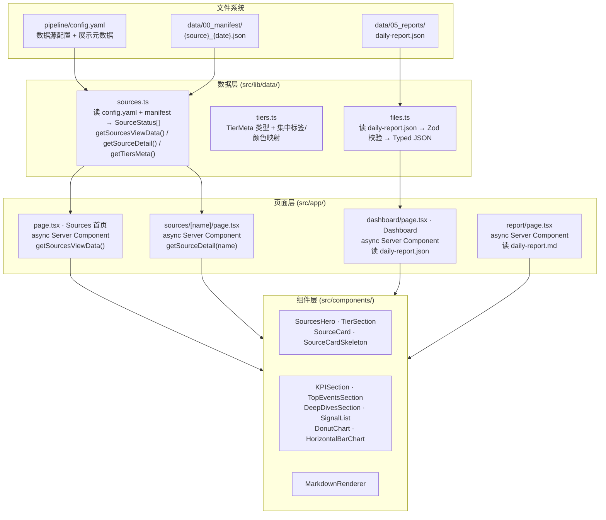

# 前端 UI 设计说明

> Daily AI Insight Engine — Next.js 数据看板的组件架构、数据流、视觉设计与模块划分

---

## 目录

- [1. 文档定位](#1-文档定位)
- [2. 前端架构总览](#2-前端架构总览)
- [3. 数据流转链路](#3-数据流转链路)
- [4. 设计系统与视觉 Token](#4-设计系统与视觉-token)
- [5. 页面模块详解](#5-页面模块详解)
  - [5.1 数据源列表页](#51-数据源列表页-sources-page)
  - [5.2 数据源详情页](#52-数据源详情页-source-detail-page)
  - [5.3 Dashboard 看板页](#53-dashboard-看板页)
  - [5.4 Report 报告页](#54-report-报告页)
- [6. 组件职责与复用关系](#6-组件职责与复用关系)
- [7. 加载状态与骨架屏策略](#7-加载状态与骨架屏策略)
- [8. 代码组织与维护指南](#8-代码组织与维护指南)

---

## 1. 文档定位

本文档描述 Daily AI Insight Engine 前端 UI 层的完整设计：**页面需要哪些数据、数据如何从 Pipeline 产出物流转到组件、组件树如何划分职责、视觉设计遵循哪些规则**。

**读者对象**：前端开发者、新增页面/组件时需要理解现有架构的项目成员。

**前置文档**：[0_整体设计说明](./0_整体设计说明.md)（架构总览）、[1_数据源筛选与获取设计说明](./1_数据源筛选与获取设计说明.md)（Pipeline 数据产出）。

---

## 2. 前端架构总览

前端采用 **Next.js 16 App Router + 服务端组件直接读 JSON 文件** 的零 API 层架构：



**关键设计原则**：

| 原则 | 说明 |
|------|------|
| **零 API 层** | 服务端组件在请求时通过 `node:fs` 直读 JSON，无数据库、无 REST endpoint。Pipeline 产出物就是前端数据源 |
| **force-dynamic** | 所有页面标记 `export const dynamic = "force-dynamic"`，禁止静态导出，每次请求重新读取最新 JSON |
| **Server/Client 分离** | 页面是 Server Component（负责数据获取），可交互的卡片/图表是 Client Component（`"use client"`），两者通过 props 传递数据 |
| **双 Schema 契约** | Python 侧 Pydantic v2 → TypeScript 侧 Zod v3，两边独立定义相同的数据形状 |

---

## 3. 数据流转链路

### 3.1 数据源列表页 (Sources Page) 的完整数据流

```
pipeline/config.yaml
  ├── tiers_meta: {A: {label, subtitle, rationale}, B: {...}, C: {...}}
  ├── sources[0..N]: {name, display_name, display_description, type, tier,
  │                     language, fetch_strategy, filter.keywords, url, ...}
  │
  └─► getSourceConfigs() ──── 解析 YAML →
      {
        过滤 enabled: true → SourceConfig[]
        解析 tiers_meta → Record<string, TierMeta>
      }
                                                                     data/00_manifest/*.json
                                                                       ├── source: string
                                                                       ├── articles: [{url, title, ...}]
      loadManifests() → 按 source name 分组，保留每源最新 manifest →    ├── date: string
                                                                       └── generated_at: string
         ↓
      configToStatus(cfg, manifest) ──── 合并 → SourceStatus
        display_name        ← cfg.display_name ?? cfg.name
        display_description ← cfg.display_description ?? cfg.description
        keywords            ← cfg.filter.keywords
        articleCount        ← manifest?.articles.length ?? 0
        manifestFound       ← manifest !== undefined
        ...
         ↓
      getSourcesViewData() ──── 聚合 → {tiersMeta, sources, totalSources, totalArticles, latestDate}
         ↓
      SourcesPage (server component)
         ├── SourcesHero ──── 深色渐变 Banner: 标题 + 统计 + 三角顶点卡片 + 筛选策略
         └── SourcesGrid ──── 按 Tier 分组
              └── TierSection[] (A / B / C)
                   ├── 彩色竖条 + 大标题 + 描述副标题 + 计数 badge
                   └── SourceCard[] (3-col grid)
                        ├── display_name (标题)
                        ├── 标签行: Tier badge / type / language / article count
                        ├── display_description (3行)
                        ├── 关键词 chips (前5个 + "+N")
                        └── Footer: 文章数 + fetch_strategy
```

### 3.2 数据源详情页 (Source Detail Page) 的数据流

```
getSourceDetail(name) ──── 与 getSourceStatuses() 同源，仅取单个 source
   ↓
SourceDetailPage (server component)
   ├── 深色渐变 Hero (tier 颜色差异化)
   │    ├── 面包屑 + 标题 + 实时指示点
   │    ├── 元数据玻璃胶囊: Tier / type / language / fetch_strategy / date
   │    ├── 描述玻璃面板
   │    └── 源站 URL + 文章统计
   └── ArticleCard[] (文章列表)
        ├── 标题链接 + URL
        ├── 日期 + 作者 meta pills
        └── 摘要段落
```

### 3.3 Dashboard 看板页的数据流

```
data/05_reports/daily-report.json (由 Stage 4b 生成)
   ├── executiveSummary
   ├── topEvents[]: {title, summary, sourceType, eventType, impact, entities, ...}
   ├── deepDives[]: {title, dimension, keyFacts, implications, ...}
   ├── trendInsights[]: {observation, evidence, trend}
   ├── riskSignals[]: {signal, severity, probability}
   ├── opportunitySignals[]: {signal, opportunity, timeframe}
   └── visualizationData: {eventTypeDistribution, sentimentDistribution,
                            impactRanking, entityFrequency}
   ↓
readFile() + Zod validate (src/lib/data/files.ts)
   ↓
DashboardPage (server component)
   ├── KPISection ──── 4 个 MetricCard (顶部横排)
   ├── DistributionSection ──── DonutChart × 2 (事件类型 + 情感分布)
   ├── TopEventsSection ──── 排名编号列表 + 彩色左边条
   ├── SignalList ──── 风险 + 机会信号两列布局
   ├── DeepDivesSection ──── 3 列深度研判卡片
   ├── RankingsSection ──── 影响力排名 + 实体频率 (HorizontalBarChart)
   └── TrendInsightsSection ──── 2 列趋势卡片
```

---

## 4. 设计系统与视觉 Token

### 4.1 色彩体系

所有颜色在 `src/app/globals.css` 中以 oklch CSS 变量定义，通过 Tailwind v4 `@theme inline` 注册为 utility class：

| Token | oklch 值 | Tailwind Class | 语义用途 |
|-------|----------|---------------|----------|
| `--background` | `oklch(0.975 0.005 260)` | `bg-background` | 页面底色 |
| `--surface` | `oklch(0.992 0.003 260)` | `bg-surface` | 悬浮面板/次级表面 |
| `--panel` | `oklch(1 0 0)` | `bg-panel` | 卡片背景 |
| `--foreground` | `oklch(0.18 0.02 260)` | `text-foreground` | 主文字色 / 深色 Hero 底色 |
| `--muted` | `oklch(0.48 0.02 255)` | `text-muted` | 次级文字 |
| `--line` | `oklch(0.88 0.012 260)` | `border-line` | 边框/分割线/骨架屏闪烁 |
| `--accent` | `oklch(0.55 0.13 200)` | `text-accent` | Tier A / 品牌主色 (teal) |
| `--accent-light` | `oklch(0.90 0.04 200)` | `bg-accent-light` | 浅色 accent badge 背景 |
| `--accent-dark` | `oklch(0.35 0.09 200)` | `bg-accent-dark` | 深色渐变终点 |
| `--warm` | `oklch(0.60 0.16 85)` | 通过 `style` 引用 | Tier B / 机会信号 (amber) |
| `--cool` | `oklch(0.45 0.16 340)` | 通过 `style` 引用 | Tier C / 风险信号 (plum) |
| `--positive` | `oklch(0.55 0.16 150)` | `text-positive` | 正面情感 (green) |
| `--negative` | `oklch(0.50 0.20 20)` | `text-negative` | 负面情感 (red) |
| `--warning` | `oklch(0.65 0.18 90)` | `text-warning` | 警告/混合信号 (amber) |

> **注意**：`--warm` 和 `--cool` 没有注册为 Tailwind utility，因为 Tailwind v4 的 oklch 生成规则与这两个值不完全匹配。在组件中通过 `style={{ color: "var(--warm)" }}` 内联引用。

### 4.2 Tier 色彩分配

| Tier | 名称 | 颜色变量 | 视觉标识 |
|------|------|---------|----------|
| A | 技术与前沿 | `--accent` (teal) | 卡片顶边 3px + badge 底色 + hover 渐变 |
| B | 产品与开发者 | `--warm` (amber) | 同上 |
| C | 商业与资本 | `--cool` (plum) | 同上 |

### 4.3 常用设计模式

**卡片容器**：
```
rounded-xl border border-line bg-panel shadow-sm p-5
```

**Hover 交互**（仅可点击卡片）：
```
hover:shadow-lg hover:-translate-y-1 hover:border-accent/20
transition-all duration-300 ease-out
```

**深色渐变 Hero**（Banner / 详情页头部）：
```
rounded-2xl bg-gradient-to-br from-foreground via-foreground to-accent-dark
shadow-lg p-6 md:p-10
```
内含 SVG 装饰元素（低透明度圆形 + 虚线 + 点阵）。

**玻璃胶囊标签（深色背景用）**：
```
rounded-full border border-white/10 bg-white/5 px-3 py-1
text-[11px] font-medium text-white/70 backdrop-blur
```

**浅色 badge（浅色背景用）**：
```
rounded-full px-2.5 py-0.5 text-xs font-semibold
// 彩色填充: backgroundColor: `${color}18`, color
// 描边: border border-line text-muted/80
```

### 4.4 排版层级

| 层级 | Class | 用途 |
|------|-------|------|
| 页面主标题 | `text-2xl font-bold md:text-3xl` | Hero 标题 |
| 区块标题 | `text-xl font-bold tracking-tight` | Tier 区域标题 |
| 卡片标题 | `text-lg font-bold tracking-tight` | SourceCard 标题 |
| 正文描述 | `text-sm leading-relaxed text-muted/80` | SourceCard 描述 |
| 辅助文字 | `text-[11px] text-muted/45` | Footer 统计 |
| 技术标签 | `text-[10px] font-mono text-muted/35` | 关键词 / fetch strategy |
| Hero 副标题 | `text-sm text-white/55` | Banner 描述段落 |

### 4.5 响应式断点

| 断点 | 类 | 效果 |
|------|-----|------|
| `md` (768px) | `md:grid-cols-2` | 2 列卡片 |
| `lg` (1024px) | `lg:grid-cols-3` | 3 列卡片 |
| `sm` (640px) | `sm:grid-cols-3` | Hero 三角顶点 3 列 |
| `max-w-7xl` | `mx-auto` | 页面最大宽度 1280px 居中 |

### 4.6 动画

| 动画 | 定义 | 用途 |
|------|------|------|
| `animate-fade-up` | `translateY(12px)→0, opacity 0→1, 0.5s ease-out` | Tier 区域进入动画 |
| `animate-count-up` | `opacity 0→1, 0.6s ease-out` | KPI 数字滚动 |
| `animate-pulse` | 半透明脉冲 | 骨架屏闪烁 |
| `animate-ping` | 缩放消失脉冲 | 数据源详情页 "live" 指示点 |

---

## 5. 页面模块详解

### 5.1 数据源列表页 (Sources Page)

**路由**：`/` (首页) | **文件**：`src/app/page.tsx`

#### 5.1.1 页面结构

```
PageShell (max-w-7xl, px-4 py-6 md:py-8)
  │
  ├── SourcesHero (深色渐变 Banner)
  │    ├── "Source Intelligence" 标签
  │    ├── "数据源全景 · 黄金三角" 标题
  │    ├── 简介段落 (19 源 / 三层分类 / 过滤策略概要)
  │    ├── Stats 胶囊行 (源数 / 文章数 / 最新运行日期)
  │    ├── 三角顶点卡片 (横向 3 列, 每列: 彩色圆标 + Tier 名 + 源/文章计数 + subtitle)
  │    └── 筛选策略简述 (3 列: 关键词过滤 / 时效窗口 / 配额与去重)
  │
  └── SourcesGrid
       └── TierSection × 3 (A→B→C 顺序, 跳过空 tier)
            ├── 区域头部 (彩色竖条 + 标题 + 副标题 + 计数 badge)
            └── 3 列 Card Grid
                 └── SourceCard × N
                      ├── Tier 彩色顶边 (3px)
                      ├── display_name (标题) + 外链按钮
                      ├── Tag 行: Tier badge + type + language [+ article count]
                      ├── display_description (3 行)
                      ├── 关键词 chips (前 5 个 + "+N")
                      └── Footer: 文章数 + fetch_strategy
```

#### 5.1.2 数据依赖

```typescript
// src/lib/data/sources.ts
export async function getSourcesViewData(): Promise<{
  tiersMeta: Record<string, TierMeta>;   // 从 config.yaml tiers_meta 解析
  sources: SourceStatus[];               // config + manifest 合并结果
  totalSources: number;                  // 启用源总数
  totalArticles: number;                 // 所有源文章数之和
  latestDate: string | null;             // 最新 manifest date
}>
```

`TierMeta` 结构（定义于 `src/lib/data/tiers.ts`）：
```typescript
interface TierMeta {
  label: string;     // "技术与前沿"
  subtitle: string;  // "学术论文 & 官方技术博客 — ..."
  rationale: string; // 详细的长文本解释（用于设计参考，当前页面未直接展示）
}
```

`SourceStatus` 关键字段（定义于 `src/lib/data/sources.ts`）：
```typescript
interface SourceStatus {
  name: string;              // 唯一标识 slug (e.g. "arxiv-cs-ai")
  display_name: string;      // 人类可读名称 (e.g. "arXiv CS.AI")
  display_description: string; // 详细描述 (3-4 句)
  type: string;              // academic_paper | tech_blog | news_media | community_discussion
  tier: "A" | "B" | "C";
  language: string;          // "en" | "zh"
  fetch_strategy: string;    // "rss" | "scrape" | "browser"
  keywords: string[];        // 从 config.filter.keywords 提取
  max_age_hours: number;
  manifestFound: boolean;    // data/00_manifest/ 中是否有该源的清单
  articleCount: number;      // manifest 中的 article 数量
  manifestDate: string | null;
  // ...
}
```

#### 5.1.3 关键交互逻辑

- **有文章的卡片**：渲染为 `<Link>` → 可跳转到 `/sources/{name}` 详情页。Hover 时显示 gradient overlay + shadow lift + 标题变 accent 色。
- **无文章的卡片**：渲染为 `<div>`，`opacity-70`，无 hover 效果，不可点击。Footer 显示 "等待运行" 或 "暂无文章"。
- **外链按钮**：点击跳转到源站 URL（`window.open`），不触发卡片导航。

#### 5.1.4 配置驱动机制

页面几乎不需要硬编码任何数据。所有展示内容由 `pipeline/config.yaml` 的两个部分驱动：

1. `tiers_meta` 顶层段落 — 控制 Hero 中三角顶点卡片的文字和 TierSection 标题/副标题
2. `sources[]` 中每个源的 `display_name` 和 `display_description` — 控制卡片标题和描述

**新增数据源时的 UI 更新流程**：在 `config.yaml` 中添加 `display_name` + `display_description` 即可，无需修改任何组件代码。

---

### 5.2 数据源详情页 (Source Detail Page)

**路由**：`/sources/[name]` | **文件**：`src/app/sources/[name]/page.tsx`

#### 5.2.1 页面结构

```
PageShell
  └── 深色渐变 Hero (tier 颜色动态差异化)
       ├── 面包屑 ← "数据源列表"
       ├── 标题 (source.name) + Live 指示点
       ├── 元数据玻璃胶囊: Tier / type / language / fetch_strategy / date
       ├── 描述玻璃面板
       ├── 源站 URL 外链
       └── 统计条: 文章数 + 生成时间
  └── ArticleList (Client Component, "use client")
       ├── 列表头部: 网格图标 + 文章计数 badge + impact score 排序切换按钮
       │    └── 排序按钮: 默认排序 | Impact Score ↓ (active/inactive 状态切换)
       └── ArticleCard 列表 (space-y-3)
            ├── ArticleCardBasic — 文章标题/日期/作者/摘要
            ├── ArticleCardExtraction — 事实提取 (event_type/entities/key_logic_flow)
            └── ArticleCardAnalysis — 深度分析 (impact_score/sentiment/risk)
```

#### 5.2.2 数据依赖

```typescript
// src/lib/data/sources.ts
export async function getSourceDetail(name: string): Promise<SourceStatus | null>
```

与 `getSourceStatuses()` 使用相同的 `configToStatus()` 转换函数，但仅取 `name` 匹配的单个源。如果未找到匹配的 config，返回 `null` → 触发 Next.js `notFound()` (404)。

---

### 5.3 Dashboard 看板页

**路由**：`/dashboard` | **文件**：`src/app/dashboard/page.tsx`

数据来源为 `data/05_reports/daily-report.json`（Stage 4b 产出），通过 `src/lib/data/files.ts` 读取并 Zod 校验。详细模块划分参见项目 README 及 `0_整体设计说明.md` 第 8 节。

---

### 5.4 Report 报告页

**路由**：`/report` | **文件**：`src/app/report/page.tsx`

读取 `data/05_reports/daily-report.md` 并通过 `react-markdown` + `remark-gfm` 渲染为完整 Markdown 报告。

---

## 6. 组件职责与复用关系

### 6.1 组件清单

```
src/components/
├── layout/
│   ├── NavBar.tsx          # 顶部导航 (sticky, frosted glass, 3 links)
│   └── PageShell.tsx       # 页面容器 (max-w-7xl, responsive padding)
│
├── sources/
│   ├── SourcesHero.tsx     # 数据源页 Banner: 标题 + 三角顶点 + 统计 + 筛选策略
│   ├── SourcesGrid.tsx     # 按 Tier 分组 → 委托 TierSection
│   ├── TierSection.tsx     # 单 Tier 区域: 彩色竖条标题 + card grid
│   ├── SourceCard.tsx      # 单源卡片 (条件性 Link / div)
│   ├── SourceCardSkeleton.tsx  # 卡片骨架屏 (精确匹配 SourceCard 布局)
│   ├── ArticleList.tsx     # 文章列表 (Client Component, impact score 排序切换)
│   ├── ArticleCard.tsx     # 单篇文章展示卡片 (组装 Basic/Extraction/Analysis)
│   ├── ArticleCardBasic.tsx       # 基础信息子卡片
│   ├── ArticleCardExtraction.tsx  # 事实提取子卡片
│   ├── ArticleCardAnalysis.tsx    # 深度分析子卡片
│   ├── EntityChips.tsx     # 实体标签 chips
│   ├── ImpactScoreBar.tsx  # 影响力评分可视化条
│   ├── LogicFlow.tsx       # 关键逻辑脉络展示
│   ├── RiskSignals.tsx     # 风险信号 badges
│   ├── SentimentIndicator.tsx  # 情绪指示器
│   └── StatusBadge.tsx     # 处理状态 badge
│
├── dashboard/
│   ├── KPISection.tsx      # 4 个 KPI MetricCard
│   ├── MetricCard.tsx      # 单指标卡片 (icon + value + label + helper)
│   ├── TopEventsSection.tsx # Top 事件排名列表
│   ├── DistributionSection.tsx # 事件类型 + 情感分布 Donut 图
│   ├── DeepDivesSection.tsx # 深度研判 3 列卡片
│   ├── SignalList.tsx      # 风险/机会信号列表
│   ├── RankingsSection.tsx # 影响力排名 + 实体频率
│   ├── TrendInsightsSection.tsx # 趋势洞察 2 列卡片
│   └── Bars.tsx            # 纯 CSS 进度条
│
├── charts/
│   ├── DonutChart.tsx      # Recharts 环形图
│   ├── HorizontalBarChart.tsx # Recharts 水平柱状图
│   └── RadarChart.tsx      # Recharts 雷达图
│
└── report/
    └── MarkdownRenderer.tsx # react-markdown + remark-gfm 封装
```

### 6.2 复用规则

| 可复用模块 | 被引用位置 | 复用类型 |
|-----------|-----------|----------|
| `PageShell` | 所有页面 | 直接引用 |
| `TIER_COLORS` / `SOURCE_TYPE_LABELS` / `LANGUAGE_LABELS` | SourceCard, SourcesHero, TierSection, SourceDetailPage | 从 `tiers.ts` 导入 |
| `TierMeta` 类型 | SourcesHero, TierSection, getTiersMeta() | 从 `tiers.ts` 导入 |
| `SourceCardSkeleton` | `loading.tsx`、未来其他骨架屏 | 直接引用 |
| 深色 Hero 渐变 + SVG 装饰模式 | SourcesHero, SourceDetailPage | 模式复用（非组件复用） |
| 玻璃胶囊标签 (`border-white/10 bg-white/5`) | SourcesHero, SourceDetailPage | Tailwind 类组合复用 |

### 6.3 新增页面的指导原则

1. **数据获取** → 放在 Server Component (`page.tsx`) 中
2. **交互/Hover** → 放在 `"use client"` 组件中
3. **共享标签映射** → 从 `src/lib/data/tiers.ts` 导入，不要内联重复定义
4. **骨架屏** → 创建专用 skeleton 组件，确保与真实组件结构相同（相同的 padding、间距、子元素数量）
5. **新增展示配置** → 优先放在 `pipeline/config.yaml` 中，通过 `sources.ts` 读取，避免硬编码到组件中

---

## 7. 加载状态与骨架屏策略

### 7.1 设计原则

骨架屏的唯一要求是：**与真实页面结构一一对应**。结构不匹配会导致页面从 skeleton 过渡到内容时产生视觉跳跃（layout shift），破坏体验。

### 7.2 实现方式

```
真实页面结构                    骨架屏结构
─────────────────────────────────────────────
PageShell                       PageShell
  SourcesHero                     animate-pulse 深色区域
    title                           h-3 w-32 闪烁块
    subtitle                        h-8 w-72 闪烁块
    stats pills                     h-7 w-24 胶囊 × 3
    vertex cards (×3)               相同间距占位卡片 × 3
    filter summary                  相同间距占位文本 × 3
  SourcesGrid                     mt-10 space-y-10
    TierSection (A)                相同间距
      header (竖条 + 标题 + badge)      h-8 w-1 + h-7 w-36 + badge
      SourceCard × N               SourceCardSkeleton × 3
    TierSection (B)                ...
    TierSection (C)                ...
```

骨架屏内的所有占位块使用 `bg-line` 颜色（`oklch(0.88 0.012 260)`），通过父级 `animate-pulse` 产生闪烁效果。

`SourceCardSkeleton` 与 `SourceCard` 保持完全相同的：
- 外层容器 `rounded-xl border border-line bg-panel p-5`
- 标题行高度 (`h-6`)
- Tag 行间距 (`mt-3`, `gap-2`)
- 描述行数量 (3 行, `space-y-2`)
- 关键词 chip 行 (`mt-2.5`, `gap-1`, 4 个 chips)
- Footer 分隔线和间距 (`mt-4 pt-3 border-t`)

### 7.3 Next.js 加载机制

Next.js App Router 通过文件系统约定 `loading.tsx` 自动使用 `<Suspense>` 包裹页面：
- 首次导航到 `/` (首页) → 显示 `src/app/loading.tsx` → 数据就绪后替换为 `page.tsx`
- 首次导航到 `/dashboard` → 显示 `src/app/dashboard/loading.tsx` → 数据就绪后替换为 `dashboard/page.tsx`
- 骨架屏与真实页面结构一一对应 → 过渡无 layout shift

---

## 8. 代码组织与维护指南

### 8.1 文件路径约定

```
src/app/                         # 页面 (Route Handler)
  page.tsx                       # / — 数据源全景 (首页)
  loading.tsx                    # 首页骨架屏
  dashboard/
    page.tsx                     # /dashboard — 日报看板
    loading.tsx                  # Dashboard 页骨架屏
  report/
    page.tsx                     # /report — 完整 Markdown 报告
  sources/
    page.tsx                     # /sources — 重定向到 /
    [name]/
      page.tsx                   # /sources/[name] — 数据源详情页

src/components/                  # 可复用组件
  sources/                       # 按页面域分组 (15 个组件)
  dashboard/
  charts/
  layout/
  report/

src/lib/
  data/
    sources.ts                   # 数据源数据层 (读 config + manifest)
    status.ts                    # 处理状态类型 + StructuredArticle schema
    tiers.ts                     # Tier/Type 标签和类型定义
    files.ts                     # 通用 JSON 文件读写 + Zod
    cleaner.ts                   # 文本清洗工具
  agent/
    schema.ts                    # Zod Schema (全数据契约)
    prompts.ts                   # LLM prompt 模板
    heuristics.ts                # 分析启发式规则
    index.ts                     # Barrel export
  report/
    labels.ts                    # 报告中文标签映射
    generate-markdown.ts         # JSON → Markdown 动态生成
```

### 8.2 标签映射的单点管理

所有中文标签（Tier 名称、Source Type 名称、语言名称）集中在 `src/lib/data/tiers.ts` 中定义。整个前端只有一个权威来源：

```typescript
// src/lib/data/tiers.ts — 唯一权威的标签/颜色定义
export const TIER_COLORS: Record<string, string> = { ... };
export const SOURCE_TYPE_LABELS: Record<string, string> = { ... };
export const LANGUAGE_LABELS: Record<string, string> = { ... };
```

需要修改标签文字时，只需要修改这一个文件。

### 8.3 展示数据的配置化

所有面向 UI 的展示文案优先放在 `pipeline/config.yaml` 中通过新字段驱动：

| 展示内容 | 配置位置 | 前端读取路径 |
|---------|---------|------------|
| Tier 标签/副标题 | `config.yaml` → `tiers_meta.{A/B/C}.label / .subtitle` | `getTiersMeta()` |
| 源显示名称 | `config.yaml` → `sources[].display_name` | `source.display_name` |
| 源详细描述 | `config.yaml` → `sources[].display_description` | `source.display_description` |
| 源关键词 | `config.yaml` → `sources[].filter.keywords` | `source.keywords` |

> 注意：`tiers_meta.rationale` 字段当前仅存储详细说明文本（设计参考用途），未在前端直接渲染。如需在页面中展示完整 rationale，可在 SourcesHero 中添加对应渲染块。

### 8.4 修改已有配置的注意事项

- **Python Pipeline 兼容性**：config.yaml 中新增的 `tiers_meta`、`display_name`、`display_description` 字段不会影响 Python Pipeline 运行。Pipeline 使用 Pydantic 模型按需读取已知字段，未知字段被忽略。
- **TypeScript 类型更新**：新增 config 字段时需同步更新 `src/lib/data/sources.ts` 中的 `SourceConfig` interface 和 `configToStatus()` 映射函数。
- **SourceStatus 增量修改**：`SourceStatus` 是 `SourceConfig` 的超集（增加 manifest 相关字段）。修改 `SourceConfig` 时需确保 `configToStatus()` 为新增字段提供合理的 fallback 值（例如 `display_name ?? cfg.name`）。

### 8.5 新增展示数据的推荐流程

```
1. 在 config.yaml 中添加新字段 (如 source.new_field)
       ↓
2. 在 sources.ts 的 SourceConfig interface 中添加字段
       ↓
3. 在 configToStatus() 中添加映射 (含 fallback)
       ↓
4. 在目标组件中通过 SourceStatus prop 读取
       ↓
5. 执行 pnpm typecheck 验证类型完整性
```

---

## 附录：关键文件索引

| 文件 | 作用 |
|------|------|
| `pipeline/config.yaml` | 数据源配置（含展示元数据） |
| `src/lib/data/sources.ts` | 数据源数据层：config+manifest 合并 |
| `src/lib/data/tiers.ts` | Tier/Type 标签和类型定义 |
| `src/lib/data/files.ts` | JSON 文件读写 + Zod 校验 |
| `src/lib/agent/schema.ts` | Zod 全量数据契约 |
| `src/app/globals.css` | 设计 Token 定义 |
| `src/components/layout/PageShell.tsx` | 页面容器 |
| `src/components/sources/SourcesHero.tsx` | 数据源页 Hero Banner |
| `src/components/sources/TierSection.tsx` | 单 Tier 区块组件 |
| `src/components/sources/SourceCard.tsx` | 数据源卡片 |
| `src/components/sources/SourceCardSkeleton.tsx` | 卡片骨架屏 |
| `src/components/sources/SourcesGrid.tsx` | Tier 分组 + 委托渲染 |
| `src/components/sources/ArticleList.tsx` | 文章列表 (Client Component, 排序切换) |
| `src/components/sources/ArticleCard.tsx` | 文章卡片 (组装子卡片) |
| `src/components/sources/ImpactScoreBar.tsx` | 影响力评分可视化条 |
| `src/components/sources/StatusBadge.tsx` | 处理状态 badge |
| `src/app/page.tsx` | Sources 首页入口 |
| `src/app/loading.tsx` | Sources 页面骨架屏 |
| `src/app/dashboard/page.tsx` | Dashboard 看板入口 |
| `src/app/dashboard/loading.tsx` | Dashboard 页面骨架屏 |
| `src/app/sources/[name]/page.tsx` | Source 详情页 |
| `src/lib/data/sources.ts` | 数据源数据层 |
| `src/lib/data/status.ts` | 处理状态类型定义 |
| `src/lib/data/tiers.ts` | Tier/Type 标签映射 |
